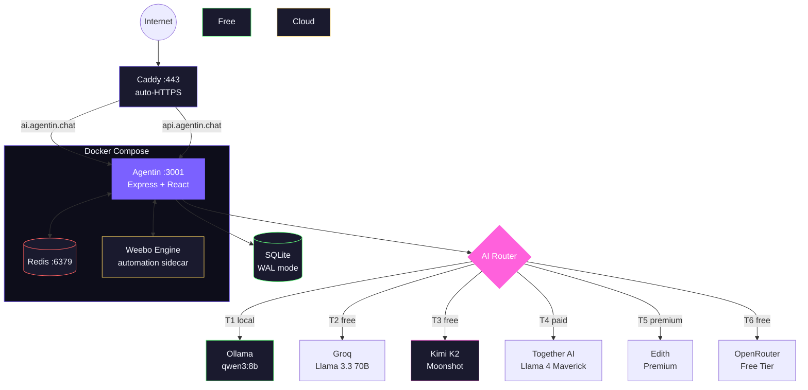

<div align="center">


<br />
<br />

[](https://ai.agentin.chat)
[](https://github.com/trendywink247-afk/GeekSpace2.0/releases)
[](https://github.com/trendywink247-afk/GeekSpace2.0/actions)
[](LICENSE)

[](https://react.dev)
[](https://www.typescriptlang.org/)
[](https://expressjs.com)
[](https://www.sqlite.org/)
[](https://www.docker.com/)
[](https://tailwindcss.com/)
[](#)
[](https://ollama.ai)

**A self-hosted AI OS — your agent, your dashboard, your portfolio.**

> v3.1.0 · Phase 6 complete · 2223 tests passing · 20/21 capabilities · main = live-production

[Live Demo](https://ai.agentin.chat) · [Documentation](docs/) · [Report Bug](.github/ISSUE_TEMPLATE/bug_report.yml) · [Request Feature](.github/ISSUE_TEMPLATE/feature_request.yml)

</div>

---

## What Is Agentin?

Agentin is a personal AI platform that gives every user their own intelligent agent, public developer portfolio, built-in terminal, and automation engine. Route queries across local and cloud AI, swap personalities, automate workflows, and share your work — all from a single self-hosted dashboard.

**No vendor lock-in. No data leaving your infra unless you choose it.**

### What makes it different

- **Local-first AI** — Ollama runs on your hardware. Cloud is optional fallback, not the default.
- **One platform, not 10 tools** — Agent, portfolio, reminders, automations, billing, terminal — unified.
- **9 AI personalities** — Weebo, Edith, Jarvis, Aria, Forge, Pulse, Echo, Cal, Nova — switch mid-message.
- **Telegram-native** — Full AI on Telegram: voice notes, inline keyboards, receipt OCR, proactive nudges.
- **Hinglish-first** — Built for Indian users. "swiggy pe 350 rupay" just works.
- **Background agents** — Weebo Engine + proactive briefings, habit nudges, expense digests.
- **Credit economy** — Fair usage with transparent per-call costs and multiple pricing tiers.

---

## Features

<table>
<tr>
<td width="50%">

**AI Agent & Chat**
- 9 Personalities — Weebo, Edith, Jarvis, Aria, Forge, Pulse, Echo, Cal, Nova
- Named agent routing: "hey Aria", "@Nova", "Forge:" switches mid-message
- 6-tier LLM waterfall: Ollama → Groq → Kimi → Together AI → Edith → OpenRouter free
- Multi-Agent Orchestrator — "launch mode" fan-out to 3 parallel specialists
- ReAct loop with 17 tools (notes, habits, reminders, expenses, focus, briefings, etc.)
- Hinglish routing — Indian language patterns + merchant auto-categories
- Long-term memory — per-user fact store, auto-injected into prompts
- Conversation context preserved across long replies (16K char window)
- SSE streaming responses
- Chat search, export, reactions, AI model preference

</td>
<td width="50%">

**Developer Portfolio**
- Public profile at `username.agentin.chat`
- AI-powered visitor chat (talk to someone's agent)
- Project showcase with AI-generated descriptions
- Connection tracking and social links
- Multiple layout themes
- Portfolio public sharing with visit analytics

</td>
</tr>
<tr>
<td>

**Automations & Background**
- Weebo Engine — up to 3 background agents per user
- Proactive Engine V3 — 30-min reminder previews, habit idle nudges at 11:00 IST
- Daily briefings with habit insights + active streaks + at-risk habits
- Telegram integration — inline keyboards (Done/Snooze/Delete), photo vision, file/doc handling
- Reminders via push, email, or Telegram; smart recurrence (daily/weekly/monthly)
- Expense tracker — track spend, categories, budget limits, weekly digest
- Habit Intelligence V2 — streak tracking, status icons, motivational nudges
- Focus/Pomodoro sessions, note-taking, global search across all data
- Cron, webhook, and health-check triggers

</td>
<td>

**Dashboard & Tools**
- Real-time stats, credit usage, activity feed
- Built-in terminal with `gs` commands and `ai "..."` queries
- API key management with AES-256-GCM encryption
- Billing with INR/USD pricing (Free → Yearly plans)
- PWA — installable on mobile and desktop
- Google Calendar sync — OAuth integration, schedule-aware briefings
- Focus mode, habits tracker, personal analytics
- Auth session management (view and revoke active sessions)
- Activity notification log

</td>
</tr>
</table>

<details>
<summary><strong>Full feature list</strong></summary>

- AI background generator (CSS gradients from natural language)
- Multi-agent bridge (6 specialist roles: analyst, coder, planner, researcher, executor, reviewer)
- OpenRouter free-tier model auto-rotation on quota exhaustion
- Artifact builder with custom subdomain hosting
- Template gallery for quick-start artifacts
- Admin ops dashboard with live SSE event stream
- OAuth signup (GitHub, Google) — framework ready
- Password reset via OTP (email + Telegram)
- Daily briefings via Telegram
- Voice notes (Groq Whisper STT + edge-tts TTS, multilingual Hindi/Telugu/English)
- Image generation (HuggingFace FLUX) with per-user gallery
- Web research — Tavily search + crawl4ai scraping + screenshot fast-path
- Google Calendar OAuth sync with briefing integration
- Multi-agent workflow builder (chain Weebo/Jarvis/Edith)
- Long-term agent memory with context injection
- Expense tracker with INR support and budget alerts
- Habit Intelligence V2 — streaks, at-risk detection, daily nudges
- Global search across notes, reminders, habits, memories
- Agent-as-Researcher — async Tavily research with Telegram delivery
- Context threading — FTS5 full-text search + search_memory tool
- Ctrl+K global search UI across all data types
- Smart Expense Categorizer — photo receipt → Groq vision → auto-log
- Habit Coach Mode — compassionate nudges with reschedule/skip buttons
- Daily Operator Mode — morning briefing as Telegram voice note
- Agentic Portfolio — visitor intent detection + Telegram alerts to owner
- Telegram Memory Capture — LLM fact extraction per conversation turn
- Fast-path routing — expense, focus, image, website, screenshot, links bypass LLM (0 credits, <700ms)
- Uptime monitoring — status.agentin.chat via Uptime Kuma

</details>

---

## Architecture



### AI Routing

| Tier | Backend | Cost | Use Case |
|------|---------|------|----------|
| **T1 Local** | Ollama qwen3:8b | 1 credit | Default — fast, private, offline-capable |
| **T2 Groq** | Llama 3.3 70B | 2 credits | Auto-fallback on Ollama busy |
| **T3 Kimi** | Kimi K2 (Moonshot) | 3 credits | Complex reasoning |
| **T4 Together** | Llama 4 Maverick 17B×128E | 5 credits | Paid primary cloud |
| **T5 Edith** | Premium sidecar | 10 cr / 1K tokens | Specialist sessions, `/premium` |
| **T6 OpenRouter** | Free tier (25 models) | 2 credits | Free cloud fallback, model rotation |
| **Multi-Agent** | 3× parallel agents | 6 credits | "launch mode" / parallel brainstorm |

### Request Flow

```
Chat → classifyIntent() → routeChat() → [provider] → parseActions() → executeActions() → Response
                                                        ↓
                                              <<<ACTION blocks>>>
                                    (portfolio updates, reminders, code gen, email)
```

---

## Quick Start

### Docker (Recommended)

```bash
git clone https://github.com/trendywink247-afk/GeekSpace2.0.git
cd GeekSpace2.0

cp .env.example .env
# Set JWT_SECRET and ENCRYPTION_KEY at minimum

docker compose up -d --build
```

Open **http://localhost:3001** — sign up or demo login (`alex@example.com` / `demo123`).

### Local Development

```bash
npm install && cd server && npm install && cd ..

# Terminal 1 — Frontend (port 5173)
npm run dev

# Terminal 2 — Backend (port 3001)
cd server && npm run dev
```

### Run Tests

```bash
cd server && npm test              # Unit tests (Vitest)
npx playwright test                # E2E tests (needs dev servers)
npm run lint                       # ESLint
```

---

## Tech Stack

| Layer | Technologies |
|-------|-------------|
| **Frontend** | React 19, TypeScript, Vite 7, Tailwind CSS, shadcn/ui, Zustand, Recharts, Lucide Icons |
| **Backend** | Express 4, TypeScript, SQLite (better-sqlite3, WAL), JWT (HS256), Zod, Pino, Helmet |
| **AI** | Ollama + Groq + Gemini Flash + Together AI + Kimi K2 |
| **Infra** | Docker (Node 20 Alpine), Caddy (auto-HTTPS), Redis 7, PM2 (2 cluster workers) |
| **Testing** | Vitest, Playwright, supertest |
| **CI/CD** | GitHub Actions (lint, unit, E2E, smoke tests) |

---

## Configuration

Copy `.env.example` → `.env`. See [`docs/ENV_VARS.md`](docs/ENV_VARS.md) for the full list.

| Variable | Required | Description |
|----------|----------|-------------|
| `JWT_SECRET` | Yes (prod) | 64-byte hex signing secret |
| `ENCRYPTION_KEY` | Yes (prod) | 32-byte hex AES key |
| `OLLAMA_BASE_URL` | No | Local AI endpoint |
| `OPENROUTER_API_KEY` | No | Enables cloud AI routing |
| `TELEGRAM_BOT_TOKEN` | No | Enables Telegram integration |
| `REDIS_URL` | No | Cache + rate limiting |
| `ADMIN_TOKEN` | No | Ops dashboard access |

---

## API

> Full reference: [`docs/API.md`](docs/API.md)

<details>
<summary><strong>Key endpoints</strong></summary>

| Method | Path | Auth | Description |
|--------|------|------|-------------|
| `POST` | `/api/auth/signup` | — | Create account |
| `POST` | `/api/auth/login` | — | Sign in |
| `POST` | `/api/auth/forgot-password` | — | Request password reset OTP |
| `POST` | `/api/agent/chat` | JWT | Chat with AI agent |
| `POST` | `/api/agent/chat/stream` | JWT | SSE streaming chat |
| `GET` | `/api/portfolio/:username` | — | Public portfolio |
| `POST` | `/api/pico/tasks/plan` | JWT | Queue background task |
| `GET` | `/api/billing/plans` | — | List pricing plans |
| `GET` | `/api/health` | — | System health check |
| `GET` | `/admin` | Admin | Ops dashboard |

</details>

---

## Security

- JWT with HS256 algorithm pinning + bcrypt (cost 12)
- AES-256-GCM + scrypt for stored API keys
- Helmet with strict CSP + HSTS + X-Frame-Options DENY
- Zod validation on all mutating endpoints
- Rate limiting: 200/15min global, 10/15min auth, 30/15min chat
- OTP-based password reset with rate limiting and audit logging
- Non-root Docker user, CORS restricted, Telegram webhook verification

> See [`SECURITY.md`](SECURITY.md) for reporting vulnerabilities.

---

## Contributing

We welcome contributions! See [`CONTRIBUTING.md`](CONTRIBUTING.md) for setup instructions, coding standards, and PR guidelines.

---

## License

[MIT](LICENSE) — build whatever you want.

---

<div align="center">

Built with obsession by [@trendywink247](https://github.com/trendywink247-afk)

<sub>

[Live App](https://ai.agentin.chat) · [Documentation](docs/) · [Report Bug](https://github.com/trendywink247-afk/GeekSpace2.0/issues/new?template=bug_report.yml) · [Request Feature](https://github.com/trendywink247-afk/GeekSpace2.0/issues/new?template=feature_request.yml)

</sub>

</div>
