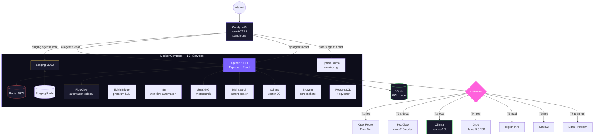

<div align="center">


<br />
<br />

[](https://ai.agentin.chat)
[](https://github.com/trendywink247-afk/GeekSpace2.0/releases)
[](https://github.com/trendywink247-afk/GeekSpace2.0/actions)
[](LICENSE)

[](https://react.dev)
[](https://www.typescriptlang.org/)
[](https://expressjs.com)
[](https://www.sqlite.org/)
[](https://www.docker.com/)
[](https://tailwindcss.com/)
[](#)
[](https://ollama.ai)

**A self-hosted AI OS — your agent, your dashboard, your portfolio.**

> v3.3.0 · Agentic Experience · Goals + Delegation + Deep Reasoning · 2552 tests · Security-hardened · 15+ Docker services · PR-based CI/CD

[Live Demo](https://ai.agentin.chat) · [Documentation](docs/) · [Report Bug](.github/ISSUE_TEMPLATE/bug_report.yml) · [Request Feature](.github/ISSUE_TEMPLATE/feature_request.yml)

</div>

---

## What Is Agentin?

Agentin is a personal AI platform that gives every user their own intelligent agent, public developer portfolio, built-in terminal, and automation engine. Route queries across local and cloud AI, swap personalities, automate workflows, and share your work — all from a single self-hosted dashboard.

**No vendor lock-in. No data leaving your infra unless you choose it.**

### What makes it different

- **Local-first AI** — Ollama runs on your hardware. Cloud is optional fallback, not the default.
- **One platform, not 10 tools** — Agent, portfolio, reminders, automations, billing, terminal — unified.
- **9 AI personalities** — Weebo, Edith, Jarvis, Aria, Forge, Pulse, Echo, Cal, Nova — switch mid-message.
- **Auto-delegation** — Weebo detects intent and routes to the right specialist agent automatically.
- **Multi-agent council** — Fan-out to parallel specialists for complex queries.
- **Goal-driven autonomy** — Set goals, agents decompose into steps, pursue them autonomously, report progress.
- **Inter-agent delegation** — Agents hand off work to specialists mid-conversation with full audit trail.
- **Deep reasoning** — Complex queries get 10-iteration reasoning with self-reflection and plan-then-execute.
- **Proactive goal engine** — Agents auto-execute steps, nudge stale goals, send daily progress summaries.
- **Telegram-native** — Full AI on Telegram: voice notes, inline keyboards, receipt OCR, proactive nudges.
- **Hinglish-first** — Built for Indian users. "swiggy pe 350 rupay" just works.
- **Background agents** — Weebo Engine + proactive briefings, habit nudges, expense digests.
- **Credit economy** — Fair usage with transparent per-call costs and multiple pricing tiers.
- **Security-hardened** — 28 findings audited and fixed (Session 9). JWT 15m expiry, no hardcoded secrets, `no-new-privileges` on all containers.

---

## Features

<table>
<tr>
<td width="50%">

**AI Agent & Chat**
- 9 Personalities — Weebo, Edith, Jarvis, Aria, Forge, Pulse, Echo, Cal, Nova
- Named agent routing: "hey Aria", "@Nova", "Forge:" switches mid-message
- Cloud-first LLM waterfall: OpenRouter-free → PicoClaw → Ollama → Groq → Together → Maverick → Kimi → Edith
- PicoClaw circuit breaker (1 failure → 5min cooldown)
- Auto-delegation: Weebo routes to Cal/Echo/Forge/Aria/Pulse/Nova/Jarvis by intent
- Multi-Agent Council — "launch mode" fan-out to 3 parallel specialists
- ReAct loop with 23 tools (notes, habits, reminders, expenses, focus, briefings, goals, artifacts, etc.)
- Deep Reasoning Engine — 10 iterations, self-reflection, plan-then-execute for complex queries
- Goal System — create goals, AI decomposes into steps, agents pursue autonomously
- Inter-Agent Delegation — agents hand off work to specialists with audit trail
- Workspace Artifacts — shared scratchpad for inter-agent collaboration
- Hinglish routing — Indian language patterns + merchant auto-categories
- Long-term memory — per-user fact store, auto-injected into prompts
- Conversation context preserved across long replies (16K char window)
- SSE streaming responses
- Chat search, export, reactions, AI model preference

</td>
<td width="50%">

**Developer Portfolio**
- Public profile at `username.agentin.chat`
- AI-powered visitor chat (talk to someone's agent)
- Project showcase with AI-generated descriptions
- Connection tracking and social links
- Multiple layout themes
- Portfolio public sharing with visit analytics

</td>
</tr>
<tr>
<td>

**Automations & Agentic Engine**
- Weebo Engine — up to 3 background agents per user
- Proactive Goal Engine — auto-executes goal steps, nudges stale goals, daily summaries
- Agent-Initiated Notifications — milestone alerts at 25/50/75/100% via SSE + Telegram
- Autonomy Levels — manual, suggest, semi_auto, full_auto (user controls how proactive agents are)
- Proactive Engine V3 — 30-min reminder previews, habit idle nudges at 11:00 IST
- Daily briefings with habit insights + active streaks + at-risk habits
- Telegram integration — inline keyboards (Done/Snooze/Delete), photo vision, file/doc handling
- Reminders via push, email, or Telegram; smart recurrence (daily/weekly/monthly)
- Expense tracker — track spend, categories, budget limits, weekly digest
- Habit Intelligence V2 — streak tracking, status icons, motivational nudges
- Focus/Pomodoro sessions, note-taking, global search across all data
- Cron, webhook, and health-check triggers

</td>
<td>

**Dashboard & Tools**
- Real-time stats, credit usage, activity feed
- Built-in terminal with `gs` commands and `ai "..."` queries
- API key management with AES-256-GCM encryption
- Billing with INR/USD pricing (Free → Yearly plans)
- PWA — installable on mobile and desktop
- Google OAuth — Calendar + Gmail + Sign-in
- Focus mode, habits tracker, personal analytics
- Auth session management (view and revoke active sessions)
- Activity notification log

</td>
</tr>
<tr>
<td colspan="2">

**Office Page**
- Pixel-perfect agent sprites (16x32, 3-row layout, integer 2x scaling)
- BFS pathfinding with collision map, room zones, smart objects
- Activity stream with 12 event types + agent attribution
- 60/40 layout: canvas left, SmartSidebar right
- Day/night mode, animation tiers, insight toasts
- Delegation particle beams + state indicators
- Agent visual offsets, task labels, meeting glow, thinking bubbles

</td>
</tr>
</table>

<details>
<summary><strong>Full feature list</strong></summary>

- AI background generator (CSS gradients from natural language)
- Multi-agent bridge (6 specialist roles: analyst, coder, planner, researcher, executor, reviewer)
- OpenRouter free-tier model auto-rotation on quota exhaustion
- Artifact builder with custom subdomain hosting
- Template gallery for quick-start artifacts
- Admin ops dashboard with live SSE event stream
- OAuth signup (GitHub, Google) — framework ready
- Password reset via OTP (email + Telegram)
- Daily briefings via Telegram
- Voice notes (Groq Whisper STT + edge-tts TTS, multilingual Hindi/Telugu/English)
- Image generation (HuggingFace FLUX) with per-user gallery
- Web research — SearXNG (free, self-hosted) + Tavily (paid fallback) + crawl4ai scraping + screenshot fast-path
- Google Calendar OAuth sync with briefing integration
- Multi-agent workflow builder (chain Weebo/Jarvis/Edith)
- Long-term agent memory with context injection
- Expense tracker with INR support and budget alerts
- Habit Intelligence V2 — streaks, at-risk detection, daily nudges
- Global search across notes, reminders, habits, memories
- Agent-as-Researcher — async Tavily research with Telegram delivery
- Context threading — FTS5 full-text search + search_memory tool
- Ctrl+K global search UI across all data types
- Smart Expense Categorizer — photo receipt → Groq vision → auto-log
- Habit Coach Mode — compassionate nudges with reschedule/skip buttons
- Daily Operator Mode — morning briefing as Telegram voice note
- Agentic Portfolio — visitor intent detection + Telegram alerts to owner
- Telegram Memory Capture — LLM fact extraction per conversation turn
- Fast-path routing — 10 fast-paths (image, website, screenshot, links, expense, focus, reminder, habit, briefing, list-reminders) bypass LLM (0 credits, <700ms)
- SearXNG self-hosted search — free metasearch replacing paid Tavily as primary
- Meilisearch instant search — typo-tolerant search for notes/reminders/habits
- Qdrant vector DB — semantic memory search for conversation context
- Uptime monitoring — status.agentin.chat via Uptime Kuma

</details>

---

## Architecture



### Services

| Service | Port | Purpose |
|---------|------|---------|
| **geekspace** | 3001 | Main application (Express + React) |
| **staging** | 3002 | Staging environment (isolated DB + Redis) |
| **redis** | 6379 | Cache, rate limiting, sessions |
| **staging-redis** | 6380 | Staging cache (64MB cap) |
| **picoclaw** | -- | Automation sidecar (qwen2.5-coder) |
| **edith-bridge** | -- | Premium LLM bridge |
| **n8n** | 5678 | Workflow automation (localhost-bound) |
| **uptime-kuma** | 3001 | Status monitoring (status.agentin.chat) |
| **searxng** | 8080 | Self-hosted metasearch |
| **meilisearch** | 7700 | Instant typo-tolerant search |
| **qdrant** | 6333 | Vector DB for semantic memory |
| **browser** | 3000 | Headless browser for screenshots |
| **geekos-postgres** | 5432 | PostgreSQL + pgvector |
| **ollama** | 11434 | Local LLM (external, systemd) |
| **caddy** | 443 | Reverse proxy + auto-HTTPS (standalone) |

### AI Routing (Cloud-First Waterfall)

| Priority | Backend | Cost | Use Case |
|----------|---------|------|----------|
| **1** | OpenRouter Free (25 models) | 2 credits | Primary cloud, model rotation |
| **2** | PicoClaw (qwen2.5-coder) | 1 credit | Fast sidecar, circuit breaker (1 fail = 5min cooldown) |
| **3** | Ollama (hermes3:8b) | 1 credit | Local fallback, private, 20s timeout |
| **4** | Groq (Llama 3.3 70B) | 2 credits | Free cloud fallback |
| **5** | Together AI (Llama 4 Maverick) | 5 credits | Paid cloud |
| **6** | Kimi K2 (Moonshot) | 3 credits | Complex reasoning |
| **7** | Edith Premium | 10 cr/1K tokens | Specialist sessions |
| **Multi-Agent** | 3x parallel agents | 6 credits | Council mode / parallel brainstorm |

Local-pref users bypass the waterfall and route directly to Ollama.

### Auto-Delegation

Weebo detects user intent and auto-routes to the right specialist:

| Agent | Domain |
|-------|--------|
| Cal | Calendar, scheduling |
| Echo | Memory, recall |
| Forge | Code, technical |
| Aria | Creative, writing |
| Pulse | Health, fitness |
| Nova | Research, analysis |
| Jarvis | Automation, tasks |

Tier limits: Free=10/day, Intro=50, Monthly/Yearly=200, Pro=500, Team=unlimited.

### Request Flow

```
Chat → classifyIntent() → routeChat() → [provider waterfall] → parseActions() → executeActions() → Response
                ↓                                                       ↓
       Auto-delegation                                        <<<ACTION blocks>>>
   (Cal/Echo/Forge/Aria/...)                        (portfolio, reminders, code gen, email)
```

---

## OOM Protection

Three-layer memory protection for the 32GB VPS:

| Layer | Mechanism | Details |
|-------|-----------|---------|
| **1. earlyoom** | systemd service | Triggers at 8% free RAM / 5% free swap. Prefers killing ollama/crawl4ai/chrome, avoids node/sshd |
| **2. Kernel** | sysctl tuning | `vm.overcommit_memory=0` (heuristic), `vm.swappiness=5`, `vm.oom_kill_allocating_task=1` |
| **3. Docker** | Container caps | crawl4ai=512MB, ollama=6GB, browser=1.5GB, app=1GB. All containers CPU-limited |

---

## Environments

| Domain | Container | Purpose |
|--------|-----------|---------|
| ai.agentin.chat | geekspace:3001 | Production |
| api.agentin.chat | geekspace:3001 | Production API |
| staging.agentin.chat | staging:3002 | Staging / Preview |
| status.agentin.chat | uptime-kuma:3001 | Uptime monitoring |

Staging has isolated Redis (64MB cap) and a separate DB volume.

---

## Project Structure

```
GeekSpace2.0/
├── src/                        # React 19 frontend (TypeScript)
│   ├── components/             #   Reusable UI components (shadcn/ui)
│   ├── dashboard/pages/        #   38 dashboard pages (chat, reminders, billing, etc.)
│   ├── services/api.ts         #   Axios API client with JWT interceptor
│   ├── stores/                 #   Zustand state management
│   ├── hooks/                  #   14 custom React hooks
│   ├── i18n/                   #   Internationalization (Hindi, English)
│   └── landing/                #   Public landing page
├── server/                     # Express 4 backend (TypeScript)
│   └── src/
│       ├── app.ts              #   Express app factory + middleware stack
│       ├── config.ts           #   Validated env configuration (100+ vars)
│       ├── db/index.ts         #   SQLite schema (60+ tables, WAL mode)
│       ├── routes/             #   65+ API endpoints by domain
│       │   ├── agent/          #     AI chat, streaming, memory, workflows
│       │   ├── auth.ts         #     Signup, login, OAuth, password reset
│       │   ├── billing.ts      #     Stripe/Razorpay checkout + webhooks
│       │   └── ...             #     reminders, portfolio, automations, admin
│       ├── services/           #   98 business logic services
│       │   ├── llm.ts          #     7-tier LLM router + intent classification
│       │   ├── message-router.ts #   Unified message handling (web/Telegram)
│       │   ├── react-loop.ts   #     ReAct loop with 17 tools
│       │   └── ...             #     memory, billing, scheduling, media, etc.
│       ├── middleware/         #   Auth (JWT), validation (Zod), errors, metrics
│       ├── repositories/      #   Data access (User, Conversation, Subscription, etc.)
│       └── test/              #   2552 unit tests (Vitest)
├── e2e/                       # Playwright E2E tests (22 specs)
├── docs/                      # Technical documentation
├── ops/                       # Operational docs and audit reports
├── scripts/                   # 38+ deployment/automation scripts
├── infra/                     # Infrastructure documentation
├── openapi/                   # OpenAPI 3.1 specification
├── picoclaw/                  # PicoClaw AI triage sidecar
├── caddy/                     # Reverse proxy configuration
├── docker-compose.yml         # 15+ service orchestration
├── Dockerfile                 # Multi-stage production build (Node 20)
└── .github/workflows/         # CI/CD (lint, test, build, deploy)
```

> See [`docs/DEVELOPER_GUIDE.md`](docs/DEVELOPER_GUIDE.md) for annotated walkthroughs of each directory.

---

## Quick Start

### Docker (Recommended)

```bash
git clone https://github.com/trendywink247-afk/GeekSpace2.0.git
cd GeekSpace2.0

cp .env.example .env
# Set JWT_SECRET and ENCRYPTION_KEY at minimum

docker compose up -d --build
```

Open **http://localhost:3001** — sign up or demo login (`alex@example.com` / `demo123`).

### Local Development

```bash
npm install && cd server && npm install && cd ..

# Terminal 1 — Frontend (port 5173)
npm run dev

# Terminal 2 — Backend (port 3001)
cd server && npm run dev
```

### Run Tests

```bash
cd server && npm test              # 2552 tests, 0 fail (Vitest)
npx playwright test                # E2E tests (needs dev servers)
npm run lint                       # ESLint
```

### Deploy to Production

```bash
# 1. Build
cd ~/GeekSpace2.0/server && npm run build   # 0 TS errors
cd ~/GeekSpace2.0 && npm run build           # frontend

# 2. Redeploy backend container
docker compose up -d --build geekspace

# 3. Sync static files (Caddy serves from /srv, not container)
docker cp geekspace-app:/app/dist/assets/. /srv/assets/
docker cp geekspace-app:/app/dist/index.html /srv/index.html

# 4. Update Caddy config (if Caddyfile changed)
cp caddy/Caddyfile /etc/caddy/Caddyfile && caddy reload --config /etc/caddy/Caddyfile

# 5. Verify
curl localhost:3001/api/health               # 12 services
```

### Deploy to Staging

```bash
docker compose up -d --build staging
curl localhost:3002/api/health
```

---

## Tech Stack

| Layer | Technologies |
|-------|-------------|
| **Frontend** | React 19, TypeScript, Vite 7, Tailwind CSS, shadcn/ui, Zustand, Recharts, Lucide Icons |
| **Backend** | Express 4, TypeScript, SQLite (better-sqlite3, WAL), JWT (HS256), Zod, Pino, Helmet |
| **AI** | Ollama + Groq + Together AI + Kimi K2 + OpenRouter Free + PicoClaw + Edith |
| **Search** | SearXNG (metasearch), Meilisearch (instant), Qdrant (vector/semantic) |
| **Infra** | Docker (Node 20 Alpine), Caddy (auto-HTTPS, standalone), Redis 7, PostgreSQL + pgvector |
| **Monitoring** | Uptime Kuma (status.agentin.chat), n8n (workflow automation) |
| **Testing** | Vitest (2552 tests), Playwright, supertest |
| **CI/CD** | GitHub Actions (lint, unit, E2E, smoke tests, npm audit) |

---

## Configuration

Copy `.env.example` → `.env`. See [`docs/ENV_VARS.md`](docs/ENV_VARS.md) for the full list.

| Variable | Required | Description |
|----------|----------|-------------|
| `JWT_SECRET` | Yes (prod) | 64-byte hex signing secret |
| `ENCRYPTION_KEY` | Yes (prod) | 32-byte hex AES key |
| `GATE_COOKIE_VALUE` | Yes (prod) | Gate page cookie secret (server-verified) |
| `OLLAMA_BASE_URL` | No | Local AI endpoint |
| `OPENROUTER_API_KEY` | No | Enables cloud AI routing |
| `TELEGRAM_BOT_TOKEN` | No | Enables Telegram integration |
| `REDIS_URL` | No | Cache + rate limiting |
| `REDIS_PASSWORD` | No | Redis authentication |
| `ADMIN_TOKEN` | No | Ops dashboard access |
| `GPG_PASSPHRASE` | No | Encrypted backup archives |

---

## API

> Full reference: [`docs/API_REFERENCE.md`](docs/API_REFERENCE.md) | OpenAPI spec: [`openapi/openapi.yaml`](openapi/openapi.yaml)

<details>
<summary><strong>Key endpoints (65+ total)</strong></summary>

| Method | Path | Auth | Description |
|--------|------|------|-------------|
| `POST` | `/api/auth/signup` | — | Create account |
| `POST` | `/api/auth/login` | — | Sign in |
| `POST` | `/api/auth/forgot-password` | — | Request password reset OTP |
| `POST` | `/api/agent/chat` | JWT | Chat with AI agent |
| `POST` | `/api/agent/chat/stream` | JWT | SSE streaming chat |
| `GET` | `/api/agent/memory` | JWT | List memory entries |
| `GET` | `/api/reminders` | JWT | List reminders |
| `GET` | `/api/automations` | JWT | List automations |
| `GET` | `/api/portfolio/:username` | — | Public portfolio |
| `POST` | `/api/billing/checkout` | JWT | Initiate payment |
| `POST` | `/api/billing/webhook` | Stripe | Payment events |
| `GET` | `/api/health` | — | Public health status |
| `GET` | `/api/health/detailed` | Admin | Full health with internals |

See [`docs/API_REFERENCE.md`](docs/API_REFERENCE.md) for all 65+ endpoints with request/response schemas.

</details>

---

## Security

Full 5-agent security audit (Session 9, 2026-03-23) found 28 findings. All critical and high-severity issues fixed.

**Authentication & Crypto**
- JWT HS256 with **15-minute access tokens** + 30-day refresh tokens
- bcrypt (cost 12) for passwords
- AES-256-GCM + scrypt for stored API keys
- Gate cookie env-configurable with server-side `timingSafeEqual` verification

**Application Hardening**
- Helmet with strict CSP + HSTS + X-Frame-Options DENY
- Zod validation on all mutating endpoints
- Rate limiting: 200/15min global, 10/15min auth, 30/15min chat
- TTS uses `execFile()` (no shell injection)
- Health endpoint split: `/api/health` (public), `/api/health/detailed` (admin-only)
- OTP-based password reset with rate limiting and audit logging

**Infrastructure**
- All Docker containers: `no-new-privileges`, memory-capped, CPU-limited, log rotation
- Non-root Docker user, CORS restricted, Telegram webhook verification
- n8n bound to localhost only
- Caddy blocks admin paths (`/admin`, `/n8n`, `/ops`)
- sshd: keys-only authentication, no password login
- All service passwords in `.env` only (no hardcoded defaults in compose)

**Backups**
- Daily 3 AM backup: SQLite WAL checkpoint, Postgres dump, Docker volumes, `.env`
- Off-site backup via rclone (`scripts/offsite-backup.sh`)
- GPG encryption support for backup archives

<details>
<summary><strong>Session 9 audit findings (28 total)</strong></summary>

| ID | Severity | Finding | Fix |
|----|----------|---------|-----|
| C-1 | Critical | Hardcoded passwords in compose | Moved to `.env` only |
| C-2 | Critical | Gate cookie hardcoded | Env-configurable + `timingSafeEqual` |
| C-3 | Critical | No off-site backups | rclone infrastructure added |
| H-1 | High | TTS command injection | `exec()` replaced with `execFile()` |
| H-2 | High | JWT 7-day expiry | Reduced to 15 minutes |
| H-3 | High | Health endpoint leaks internals | Split public/admin endpoints |
| H-4 | High | Caddy admin paths exposed | Path-level blocking |
| H-5 | High | n8n externally accessible | Bound to 127.0.0.1 |
| H-6 | High | Health check Redis auth failure | Auth credentials fixed |
| H-7 | High | Backup gaps | WAL, volumes, rotation, encryption |
| M-1 | Medium | No Docker log rotation | `max-size: 10m, max-file: 3` |
| M-3 | Medium | SearXNG unpinned image | Pinned to specific tag |
| M-4 | Medium | No npm audit in CI | Added to pipeline |
| M-7 | Medium | Missing no-new-privileges | Added to all containers |
| M-9 | Medium | sshd allows passwords | Keys-only enforced |

Plus 13 additional medium/low findings addressed.

</details>

> See [`SECURITY.md`](SECURITY.md) for reporting vulnerabilities.

---

## Documentation

| Document | Audience | Description |
|----------|----------|-------------|
| [`docs/SOLUTION_ARCHITECTURE.md`](docs/SOLUTION_ARCHITECTURE.md) | Engineers, Architects | C4 diagrams, request flows, domain boundaries, security model |
| [`docs/DEVELOPER_GUIDE.md`](docs/DEVELOPER_GUIDE.md) | Engineers | Local setup, repo structure, recipes, debugging, conventions |
| [`docs/API_REFERENCE.md`](docs/API_REFERENCE.md) | Engineers, Integrators | All 65+ endpoints, auth, errors, webhooks, SSE streaming |
| [`openapi/openapi.yaml`](openapi/openapi.yaml) | Engineers, Integrators | OpenAPI 3.1 spec with schemas and webhook payloads |
| [`docs/BUSINESS_FEATURES.md`](docs/BUSINESS_FEATURES.md) | PMs, BAs, QA | Feature inventory, credit economy, agent personalities |
| [`docs/DEVOPS.md`](docs/DEVOPS.md) | DevOps, SREs | Docker services, CI/CD, monitoring, backups, runbooks |
| [`docs/TESTING.md`](docs/TESTING.md) | Engineers, QA | Test inventory, coverage, patterns, CI integration |
| [`docs/MICROSERVICES_ROADMAP.md`](docs/MICROSERVICES_ROADMAP.md) | Architects, Leads | 13 domain boundaries, extraction waves, migration strategy |
| [`docs/ENV_VARS.md`](docs/ENV_VARS.md) | Engineers, DevOps | 100+ environment variables with defaults and notes |
| [`docs/DEPLOYMENT.md`](docs/DEPLOYMENT.md) | DevOps | Production deployment procedures |
| [`docs/DOC_MAP.md`](docs/DOC_MAP.md) | Everyone | Master index of all project documentation |

---

## Contributing

We welcome contributions! See [`CONTRIBUTING.md`](CONTRIBUTING.md) for coding standards and PR guidelines, or [`docs/DEVELOPER_GUIDE.md`](docs/DEVELOPER_GUIDE.md) for full setup instructions.

---

## License

[MIT](LICENSE) — build whatever you want.

---

<div align="center">

Built with obsession by [@trendywink247](https://github.com/trendywink247-afk)

<sub>

[Live App](https://ai.agentin.chat) · [Documentation](docs/) · [Report Bug](https://github.com/trendywink247-afk/GeekSpace2.0/issues/new?template=bug_report.yml) · [Request Feature](https://github.com/trendywink247-afk/GeekSpace2.0/issues/new?template=feature_request.yml)

</sub>

</div>
