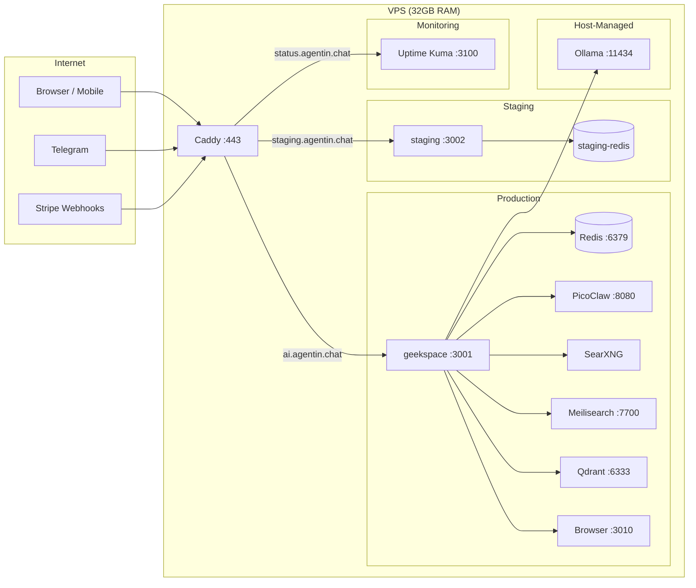
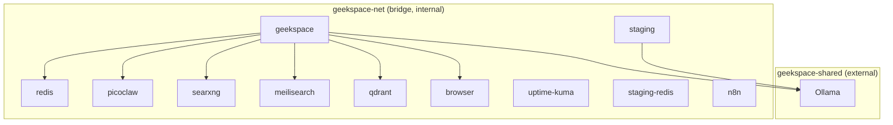
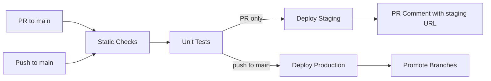

# Agentin — DevOps & Operations Guide

> Comprehensive guide for deploying, monitoring, and operating the Agentin platform.

---

## Table of Contents

- [Environment Topology](#environment-topology)
- [Docker Compose Services](#docker-compose-services)
- [Network Architecture](#network-architecture)
- [CI/CD Pipeline](#cicd-pipeline)
- [Deployment Procedures](#deployment-procedures)
- [Reverse Proxy (Caddy)](#reverse-proxy-caddy)
- [Secrets Management](#secrets-management)
- [Health Checks & Monitoring](#health-checks--monitoring)
- [Logging & Observability](#logging--observability)
- [Backup & Restore](#backup--restore)
- [Resource Budgets](#resource-budgets)
- [OOM Protection](#oom-protection)
- [Scaling Notes](#scaling-notes)
- [Operational Checklists](#operational-checklists)
- [Scripts Inventory](#scripts-inventory)
- [Failure Points & Runbooks](#failure-points--runbooks)
- [Related Documents](#related-documents)

---

## Environment Topology



| Domain | Container | Port | Purpose |
|--------|-----------|------|---------|
| `ai.agentin.chat` | geekspace | 3001 | Production app |
| `api.agentin.chat` | geekspace | 3001 | Production API (blocks `/admin`) |
| `staging.agentin.chat` | staging | 3002 | Staging / PR preview |
| `status.agentin.chat` | uptime-kuma | 3100 | Uptime monitoring |

All ports are bound to `127.0.0.1` -- external access is only through Caddy (port 443).

---

## Docker Compose Services

### Active Services

| Service | Image | Port | Memory | CPU | Health Check | Profile | Purpose |
|---------|-------|------|--------|-----|-------------|---------|---------|
| **geekspace** | Custom (Dockerfile) | 3001 | 1G | 1.0 | `curl /api/health` | default | Main app (Express + React SPA) |
| **redis** | redis:7-alpine | 6379 | 256M | 0.25 | `redis-cli ping` | default | Cache, rate limiting, job queue |
| **picoclaw** | Custom (./picoclaw) | 8080 | 64M | 0.25 | `wget /health` | default | AI triage sidecar (qwen2.5-coder:1.5b) |
| **searxng** | searxng/searxng:2026.3.12 | 8080 | 256M | 0.25 | `wget /healthz` | default | Free metasearch (replaces Tavily) |
| **meilisearch** | getmeili/meilisearch:v1.12 | 7700 | 128M | 0.25 | `curl /health` | default | Typo-tolerant instant search |
| **qdrant** | qdrant/qdrant:v1.13.2 | 6333 | 256M | 0.5 | TCP port check | default | Vector DB for semantic memory |
| **browser** | Custom (./browser-agent) | 3010 | 1536M | 1.0 | `curl /health` | default | Headless browser (screenshots, scraping) |
| **uptime-kuma** | louislam/uptime-kuma:1 | 3100 | 128M | 0.25 | `curl /` | default | Status page monitoring |
| **staging** | Custom (Dockerfile) | 3002 | 512M | 0.5 | `curl /api/health` | default | Staging environment (isolated DB) |
| **staging-redis** | redis:7-alpine | -- | 64M | 0.1 | `redis-cli ping` | default | Staging cache (isolated) |
| **n8n** | n8nio/n8n:1.78.1 | 5678 | 512M | 0.5 | `wget /healthz` | `n8n` | Workflow automation (optional) |

### Disabled Services (kept for future use)

| Service | Notes |
|---------|-------|
| **geekos** | External codebase monitoring agent (disabled in compose) |
| **geekos-postgres** | PostgreSQL + pgvector for GeekOS (disabled in compose) |
| **edith-bridge** | Premium LLM WebSocket bridge (managed externally) |

### External Services (not in compose)

| Service | Port | Manager | Purpose |
|---------|------|---------|---------|
| **Ollama** | 11434 | systemd / Hostinger | Local LLM engine (hermes3:8b) |
| **Caddy** | 443 | standalone binary | Reverse proxy + auto-HTTPS |

### Startup Order

```
redis (healthy) ──┐
                   ├──► geekspace (healthy) ──► staging
picoclaw (healthy)─┘
```

Dependencies are enforced via `depends_on` with `condition: service_healthy`. If Redis or PicoClaw fail their health checks, the main app will not start.

---

## Network Architecture



| Network | Type | Services | Purpose |
|---------|------|----------|---------|
| `geekspace-net` | bridge | All compose services | Internal communication |
| `geekspace-shared` | external | geekspace, staging, picoclaw, Ollama | Access host-managed Ollama |

The `geekspace-shared` network must be created manually before first deploy:
```bash
docker network create geekspace-shared
```

---

## CI/CD Pipeline



### Jobs

| Job | Trigger | Timeout | Steps |
|-----|---------|---------|-------|
| **Static Checks** | PR + push | 10min | Lint changed files, typecheck (root + server), build frontend, build server, npm audit |
| **Unit Tests** | After static checks | 10min | `npm --prefix server run test` (Vitest, 2552 tests) |
| **Deploy Staging** | PR only (after tests pass) | 10min | SSH to VPS, checkout PR branch, `docker compose up -d --build staging`, health check |
| **Deploy Production** | Push to main only | 10min | SSH to VPS, git pull, rebuild container, sync static files to Caddy, health check |
| **Promote Branches** | After production deploy | -- | Force-push main to `staging` and `live-production` branches |

### Concurrency

- CI runs are grouped by `ci-${{ github.ref }}` with `cancel-in-progress: true`
- Staging deploys are grouped with `cancel-in-progress: false` (queue, don't cancel)
- Production deploys are grouped with `cancel-in-progress: false`

### Required Secrets (GitHub)

| Secret | Purpose |
|--------|---------|
| `DEPLOY_HOST` | VPS IP address |
| `DEPLOY_SSH_KEY` | SSH private key for root |

---

## Deployment Procedures

### Production Deploy (Automated)

Merging a PR to `main` triggers automatic deployment:

1. CI runs static checks + unit tests
2. SSH into VPS, `git pull origin main`
3. `docker compose up -d --build geekspace`
4. Static files synced: `docker cp geekspace-app:/app/dist/assets/. /srv/assets/`
5. Health check: `curl http://localhost:3001/api/health`
6. Branches promoted: `staging`, `live-production` updated to match main

### Manual Deploy

```bash
# On VPS
cd ~/GeekSpace2.0
git pull origin main

# Build and deploy
docker compose up -d --build geekspace

# Sync static files
docker cp geekspace-app:/app/dist/assets/. /srv/assets/
docker cp geekspace-app:/app/dist/index.html /srv/index.html

# Verify
curl localhost:3001/api/health | jq .
```

### Rollback

```bash
# Find the last working commit
git log --oneline -10

# Revert to it
git checkout <commit-sha>

# Rebuild
docker compose up -d --build geekspace

# Sync static files
docker cp geekspace-app:/app/dist/assets/. /srv/assets/
docker cp geekspace-app:/app/dist/index.html /srv/index.html

# Verify
curl localhost:3001/api/health
```

### Staging Deploy

```bash
docker compose up -d --build staging
curl localhost:3002/api/health
```

Staging uses `.env.staging` with isolated Redis and database volumes.

---

## Sanctioned Remote Ops (`ops-remote-exec.yml`)

Agents and board users don't have direct SSH to the VPS. For approved
maintenance commands there is a workflow-dispatch-only path that reuses the
existing `DEPLOY_HOST` / `DEPLOY_SSH_KEY` secrets.

- Workflow: `.github/workflows/ops-remote-exec.yml`
- Trigger: **Actions → "Ops: Remote Exec" → Run workflow** (dispatch from `main` only)
- Inputs:
  - `action` — closed choice list. Current whitelist:
    - `docker-builder-prune` — runs `docker builder prune -af` and logs before/after `df -h /` + `docker system df`
    - `ssh-keys-audit` — read-only inventory of `/root/.ssh/authorized_keys` (fingerprints + comments, no private material). Output is pasted into `docs/SSH-ACCESS.md` under **Human Key Inventory** via a follow-up PR. See `docs/SSH-ACCESS.md` for the access model.
    - `rotate-jwt-encryption-preview` — dry-run validator for a future real rotation action. Verifies `/root/.agentin-secrets` mode/size, lists the variable names it contains (names only, never values), generates candidate `JWT_SECRET` / `ENCRYPTION_KEY` lengths, and confirms the backup directory is writable. Makes no changes. Used to rehearse the pipe before the actual rotation dispatch.
    - `remove-ssh-key` — destructive removal of a single line from `/root/.ssh/authorized_keys`. Requires `key_identifier` (SHA256 fingerprint preferred, exact key comment as fallback). Refuses empty/missing identifier, zero matches, or ambiguous (>1) matches. Writes a timestamped backup (`authorized_keys.bak.<UTC>`), removes the matched line, preserves mode 600, and prints a before/after diff with the base64 key blob redacted. Paired with `ssh-keys-audit` to enforce the "unattributed keys removed within one business day" policy in `docs/SSH-ACCESS.md`.
  - `reason` — free-text audit note (shown in the run log, not passed to the shell)
  - `key_identifier` — required by `remove-ssh-key` only; SHA256 fingerprint (e.g. `SHA256:abc…`) or exact key comment. Ignored by the other actions.

### How to trigger

GitHub UI:

1. Open the repo → Actions → **Ops: Remote Exec**
2. Click **Run workflow**, keep branch on `main`
3. Pick an `action`, fill in `reason`, click **Run workflow**
4. Read the run log for stdout/stderr — paste the relevant section on the ticket
   that requested the action for an audit trail

GitHub CLI (equivalent):

```bash
gh workflow run ops-remote-exec.yml \
  --ref main \
  -f action=docker-builder-prune \
  -f reason="AGE-5: reclaim docker build cache"
```

### Adding a new action

1. Append the action name to the `action` input's `options:` list.
2. Add a matching `case` arm in the SSH script. Keep every command literal —
   do not interpolate user-supplied strings into the remote shell.
3. Land the change via PR so the whitelist expansion gets normal code review.

### What this is NOT

- Not a way to get an interactive shell on the VPS
- Not a credential-provisioning path for agent containers
- Not a replacement for the regular deploy/rollback workflows

---

## Reverse Proxy (Caddy)

Caddy runs as a standalone binary (not in Docker) and handles:

- **Auto-HTTPS** via Let's Encrypt (ACME)
- **Reverse proxy** to Docker containers
- **Security headers** (CSP, HSTS, X-Frame-Options, Permissions-Policy)
- **Static file serving** for the React SPA from `/srv/`
- **SSE stream handling** with `flush_interval -1`
- **Path blocking** for admin routes on public-facing domains

### Security Headers

| Header | Value |
|--------|-------|
| X-Frame-Options | DENY |
| X-Content-Type-Options | nosniff |
| Strict-Transport-Security | max-age=31536000; includeSubDomains; preload |
| Content-Security-Policy | strict (self + fonts + wss + blob) |
| Permissions-Policy | camera=(), microphone=(), geolocation=() |
| Referrer-Policy | strict-origin-when-cross-origin |

### Admin Path Blocking

On `api.agentin.chat`, the following paths are blocked:
- `/admin`, `/admin/*` -- returns 403
- `/n8n`, `/n8n/*` -- returns 403
- `/ops`, `/ops/*` -- returns 403

### Caddy Config Location

```
/etc/caddy/Caddyfile        # Active config (Caddy reads this)
caddy/Caddyfile             # Source of truth in repo
```

To update: `cp caddy/Caddyfile /etc/caddy/Caddyfile && caddy reload --config /etc/caddy/Caddyfile`

---

## Secrets Management

### Strategy

Secrets are split into two layers:

| Layer | Location | Contents | Committed? |
|-------|----------|----------|-----------|
| `.env` | Repo root | Non-sensitive defaults (timeouts, URLs, log levels) | No (`.gitignore`) |
| `/root/.agentin-secrets` | VPS only | Real secrets (API keys, JWT_SECRET, ENCRYPTION_KEY) | No |

### Critical Secrets

| Variable | Type | Notes |
|----------|------|-------|
| `JWT_SECRET` | 64-byte hex | Required in production, generates tokens |
| `ENCRYPTION_KEY` | 64 hex chars | AES-256-GCM for stored API keys |
| `REDIS_PASSWORD` | String | Required for Redis auth |
| `STRIPE_SECRET_KEY` | Stripe key | Payment processing |
| `STRIPE_WEBHOOK_SECRET` | Stripe webhook | Webhook signature verification |
| `TELEGRAM_BOT_TOKEN` | Telegram API | Bot authentication |
| `ADMIN_TOKEN` | String | Ops dashboard access |
| `GATE_COOKIE_VALUE` | String | Gate page cookie (timingSafeEqual verified) |

See [`docs/ENV_VARS.md`](ENV_VARS.md) for the complete list of 100+ variables.

---

## Health Checks & Monitoring

### Endpoints

| Endpoint | Auth | Response |
|----------|------|----------|
| `GET /api/health` | None | DB status, Ollama, OpenRouter, uptime, version |
| `GET /api/health/detailed` | Admin token | Full internal metrics |
| `GET /api/ready` | None | Readiness probe (includes automation count) |
| `GET /api/version` | None | App version, git SHA, environment, build time |

### Uptime Kuma

Available at `status.agentin.chat`. Monitors:
- Production app health
- Staging health
- API endpoint availability
- External service reachability

### Container Health Checks

Every service has a Docker healthcheck defined in `docker-compose.yml`:

| Service | Check | Interval | Start Period | Retries |
|---------|-------|----------|-------------|---------|
| geekspace | `curl /api/health` | 30s | 30s | 3 |
| redis | `redis-cli ping` | 10s | -- | 5 |
| picoclaw | `wget /health` | 15s | 30s | 3 |
| searxng | `wget /healthz` | 30s | 15s | 3 |
| meilisearch | `curl /health` | 30s | 15s | 3 |
| qdrant | TCP 6333 check | 30s | 15s | 3 |
| browser | `curl /health` | 30s | 30s | 3 |
| uptime-kuma | `curl /` | 30s | 30s | 3 |

---

## Logging & Observability

### Log Configuration

All containers use the `json-file` driver with rotation:

| Service | max-size | max-file |
|---------|----------|----------|
| geekspace, redis, picoclaw | 50m | 5 |
| searxng, meilisearch, qdrant, browser | 10m | 3 |

### Application Logging

The Express backend uses **Pino** (structured JSON):

```bash
# View logs
docker compose logs -f geekspace --tail 100

# Filter by level
docker compose logs geekspace | jq 'select(.level >= 40)'  # warn+

# Request correlation
docker compose logs geekspace | jq 'select(.requestId == "abc123")'
```

### Log Levels

| Level | Value | Usage |
|-------|-------|-------|
| error | 50 | Unrecoverable failures |
| warn | 40 | Degraded state, fallbacks triggered |
| info | 30 | Request lifecycle, business events |
| debug | 20 | Detailed diagnostics (dev only) |

Set via `LOG_LEVEL` env var (default: `info`).

### APM Insight

Performance monitoring data stored at `/app/apminsightdata` (Docker volume: `apm-data`).

---

## Backup & Restore

### Automated Backups

Daily at 3 AM via `scripts/backup-db.sh`:

1. SQLite WAL checkpoint (`PRAGMA wal_checkpoint(TRUNCATE)`)
2. Database copy to timestamped file
3. Docker volume snapshots
4. `.env` backup

### Off-site Backup

Via `scripts/offsite-backup.sh` using rclone:

```bash
# Manual off-site backup
./scripts/offsite-backup.sh

# With GPG encryption
GPG_PASSPHRASE=xxx ./scripts/offsite-backup.sh
```

### Restore

```bash
# Stop the application
docker compose stop geekspace

# Restore database
cp /path/to/backup/geekspace.db data/geekspace.db

# Restart
docker compose up -d geekspace
curl localhost:3001/api/health
```

### Backup Verification

```bash
# Run backup drill
./scripts/backup-drill.sh
```

---

## Resource Budgets

### Memory Allocation (32GB VPS)

| Service | Limit | Typical Usage |
|---------|-------|---------------|
| geekspace | 1G | 400-600MB |
| browser | 1.5G | 200-800MB (depends on pages) |
| redis | 256M | 50-100MB |
| searxng | 256M | 100-150MB |
| qdrant | 256M | 80-120MB |
| meilisearch | 128M | 60-80MB |
| uptime-kuma | 128M | 80-100MB |
| picoclaw | 64M | 30-40MB |
| staging | 512M | 200-400MB |
| staging-redis | 64M | 20-30MB |
| n8n (optional) | 512M | 200-300MB |
| Ollama (host) | ~6G | Depends on model |
| **Total** | **~10G** | **+ Ollama + OS** |

### CPU Allocation

| Service | CPU Limit |
|---------|-----------|
| geekspace | 1.0 |
| browser | 1.0 |
| n8n | 0.5 |
| qdrant | 0.5 |
| staging | 0.5 |
| All others | 0.25 |

---

## OOM Protection

Three-layer defense:

| Layer | Mechanism | Configuration |
|-------|-----------|---------------|
| **earlyoom** | systemd service | Triggers at 8% free RAM / 5% free swap. Prefers killing ollama/crawl4ai/chrome |
| **Kernel** | sysctl tuning | `vm.overcommit_memory=0`, `vm.swappiness=5`, `vm.oom_kill_allocating_task=1` |
| **Docker** | Container limits | Memory caps on all services (see Resource Budgets above) |

---

## Scaling Notes

### Current Capacity

- PM2 cluster mode (2 workers) handles concurrent requests
- Redis handles rate limiting across workers
- SQLite WAL mode supports concurrent reads + single writer

### Vertical Scaling

- Increase container memory limits in `docker-compose.yml`
- Add PM2 workers in `server/ecosystem.config.cjs`
- Increase Redis `maxmemory`

### Horizontal Scaling (future)

- Move to PostgreSQL for multi-instance DB access
- Use Redis for session/state sharing
- Extract high-traffic services (see [`docs/MICROSERVICES_ROADMAP.md`](MICROSERVICES_ROADMAP.md))

---

## Operational Checklists

### Pre-Deploy Checklist

- [ ] All tests pass (`cd server && npm test`)
- [ ] TypeScript compiles (`npm run typecheck && cd server && npm run typecheck`)
- [ ] Frontend builds (`npm run build`)
- [ ] No new critical npm audit findings
- [ ] Environment variables up to date

### Post-Deploy Checklist

- [ ] `curl localhost:3001/api/health` returns `"status": "ok"`
- [ ] `curl https://ai.agentin.chat/api/health` returns 200
- [ ] Telegram webhook responds
- [ ] Static assets load (check browser console)
- [ ] No error spikes in logs (`docker compose logs --tail 50 geekspace`)

### Weekly Ops

- [ ] Review Uptime Kuma alerts
- [ ] Check disk usage (`df -h`)
- [ ] Verify backups exist and are recent
- [ ] Review container resource usage (`docker stats`)
- [ ] Check for security updates (`npm audit`)

---

## Scripts Inventory

| Script | Purpose | Typical Use |
|--------|---------|-------------|
| `scripts/bootstrap.sh` | Idempotent first-time setup | Initial VPS setup |
| `scripts/prod.sh` | Deploy to production | Manual deploy |
| `scripts/staging.sh` | Deploy to staging | Manual staging deploy |
| `scripts/deploy-and-test.sh` | Build, deploy, test in sequence | Full deploy cycle |
| `scripts/health-check.sh` | Verify all service health | Post-deploy verification |
| `scripts/healthcheck.sh` | Quick health probe | Monitoring |
| `scripts/smoke-test.sh` | Smoke test production | Post-deploy validation |
| `scripts/smoke-staging.sh` | Smoke test staging | Staging validation |
| `scripts/backup-db.sh` | SQLite backup + WAL checkpoint | Daily backup |
| `scripts/offsite-backup.sh` | Off-site backup via rclone | Off-site backup |
| `scripts/backup-drill.sh` | Verify backup restorability | Monthly backup test |
| `scripts/setup-offsite-backup.sh` | Configure rclone remote | One-time setup |
| `scripts/factory-run.sh` | Factory reset + full rebuild | Emergency recovery |
| `scripts/cleanup.sh` | Clean Docker artifacts | Disk space recovery |
| `scripts/repair.sh` | Repair common issues | Troubleshooting |
| `scripts/dev.sh` | Start local development | Development |
| `scripts/audit-all.sh` | Security audit | Weekly audit |
| `scripts/weekly-audit.sh` | Weekly audit wrapper | Cronicle |
| `scripts/load-test.sh` | Load testing | Performance testing |
| `scripts/launch-check.sh` | Pre-launch verification | Before releases |
| `scripts/notify-telegram.sh` | Send Telegram alerts | Alerting |
| `scripts/git-push.sh` | Safe git push with checks | CI helper |
| `scripts/pr-phase.sh` | Create PR for a phase | Development workflow |
| `scripts/publish-handoff.sh` | Publish handoff doc | Session management |
| `scripts/autonomy-run.sh` | Autonomous agent testing | Agent QA |
| `scripts/spawn-agent.sh` | Spawn background agent | Agent management |
| `scripts/queue.sh` | Queue management | Job queue ops |
| `scripts/write-phase-prompt.sh` | Generate phase prompts | Development |
| `scripts/openclaw-auto.sh` | OpenClaw automation | Agent automation |
| `scripts/cronicle-*.sh` | Cronicle job wrappers (5 scripts) | Scheduled tasks |

---

## Failure Points & Runbooks

### Redis Down

**Impact:** Rate limiting fails open, cache misses, job queue stalls.
**Detection:** Health check fails, `redis-cli ping` times out.
**Recovery:**
```bash
docker compose restart redis
docker compose logs redis --tail 20
```

### SQLite Locked

**Impact:** Write operations fail, 5-second busy timeout.
**Detection:** `SQLITE_BUSY` errors in logs.
**Recovery:**
```bash
# Check for stuck WAL
docker compose exec geekspace ls -la /app/data/geekspace.db*

# Checkpoint WAL
docker compose exec geekspace sqlite3 /app/data/geekspace.db "PRAGMA wal_checkpoint(TRUNCATE);"
```

### Ollama Unreachable

**Impact:** LLM routing skips local tier, uses cloud fallback.
**Detection:** Health endpoint shows `ollama: "unreachable"`.
**Recovery:**
```bash
systemctl restart ollama
curl http://localhost:11434/api/tags
```

### PicoClaw Circuit Breaker

**Impact:** Fast triage bypassed for 5 minutes after 1 failure.
**Detection:** Logs show `PicoClaw circuit breaker open`.
**Recovery:** Self-heals after 5 minutes. Check Ollama connectivity for PicoClaw:
```bash
docker compose logs picoclaw --tail 20
```

### High Memory Usage

**Impact:** OOM killer may terminate containers.
**Detection:** `docker stats` shows >90% memory usage.
**Recovery:**
```bash
# Check per-container usage
docker stats --no-stream

# Restart memory-heavy services
docker compose restart browser
docker compose restart geekspace
```

> For more troubleshooting scenarios, see [`docs/TROUBLESHOOTING.md`](TROUBLESHOOTING.md).

---

## Related Documents

- [`README.md`](../README.md) -- Project overview and quick start
- [`docs/DEPLOYMENT.md`](DEPLOYMENT.md) -- Detailed deployment procedures
- [`docs/TROUBLESHOOTING.md`](TROUBLESHOOTING.md) -- Common issues and solutions
- [`docs/ENV_VARS.md`](ENV_VARS.md) -- Environment variable reference
- [`docs/SOLUTION_ARCHITECTURE.md`](SOLUTION_ARCHITECTURE.md) -- System architecture
- [`docs/MICROSERVICES_ROADMAP.md`](MICROSERVICES_ROADMAP.md) -- Future scaling strategy
- [`infra/README.md`](../infra/README.md) -- Infrastructure component details
