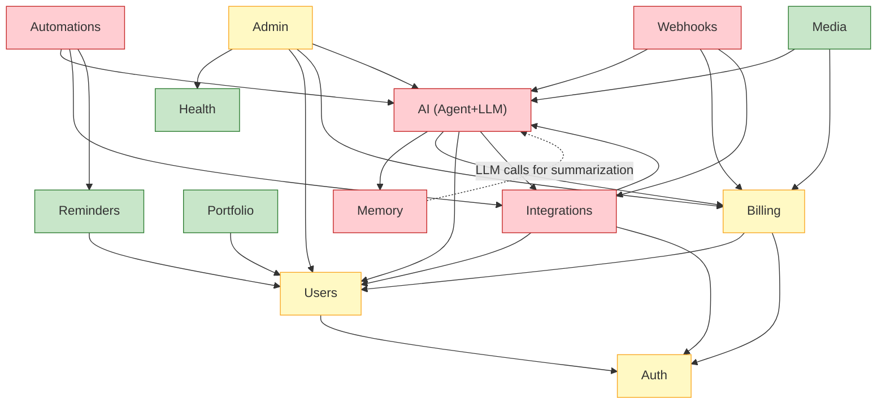

# Agentin -- Microservices Readiness Roadmap

> Living document. Last updated: 2026-03-27
>
> **TL;DR** -- Agentin is a modular monolith that _should stay a monolith_ for
> the foreseeable future. This roadmap defines 13 bounded contexts, documents
> every cross-domain dependency, and lays out the prerequisite work that must
> happen _inside_ the monolith before any service extraction is safe.

---

## 1. Current State Assessment

### What We Have

| Dimension | Reality |
|-----------|---------|
| Architecture | Modular monolith -- single Express process, single SQLite DB |
| Route files | 65+ route modules imported in `app.ts` |
| Service files | 98+ files in `server/src/services/` |
| Repositories | 5 repository classes (`UserRepository`, `AgentConfigRepository`, `ConversationRepository`, `SubscriptionRepository`, `ArtifactRepository`) -- the other ~90 services use `db.prepare()` directly |
| Event bus | In-memory `EventEmitter` wrapper (`server/src/services/event-bus.ts`) -- typed but single-process, no durability, no replay |
| Database | SQLite with WAL mode, single-writer constraint, ~90 `CREATE TABLE` statements in `server/src/db/index.ts` (2200+ line file) |
| Highest coupling point | `server/src/services/message-router.ts` (2103 lines) -- orchestrates agent chat, LLM routing, tool execution, memory, and billing in one file |
| State bus | `server/src/services/agent-state-bus.ts` -- in-memory pub/sub used by 11 files across agent, office, and activity domains |
| Auth boundary | `requireAuth` middleware is the single entry point, but many services read `users` table directly |
| Config | Environment variables via `server/src/config.ts`, no feature-flag service |

### What Is Good

- Route files are already organized by domain (auth, billing, agent, etc.)
- Typed event bus exists even if it is in-memory
- 5 repository classes show the team knows the pattern
- `domains.md` already defines 5 bounded contexts with cross-boundary rules

### What Needs Work

- **Direct DB access**: Most services bypass repositories and call `db.prepare()` -- roughly 250+ `db.prepare()` calls spread across 30+ files outside of tests
- **God objects**: `message-router.ts` (2103 lines), `db/index.ts` (2200+ lines), `agent-state-bus.ts` (used by 11 files across domains)
- **No domain modules**: `server/src/modules/` does not exist yet
- **Shared state**: Agent state bus is in-memory; restart loses all subscriber state
- **Monolithic schema**: All 90+ tables in one file, no ownership boundaries

---

## 2. Modular Monolith Strategy

### Why Modular Monolith First

Extracting microservices from a coupled monolith is the single most common cause
of failed "microservices migrations." The industry pattern is clear:

1. **Monolith** -- where Agentin is today
2. **Modular monolith** -- where Agentin needs to go next
3. **Selective extraction** -- only after modules have clean interfaces

Jumping from step 1 to step 3 creates distributed coupling: the same spaghetti,
but now with network latency, partial failures, and a deployment pipeline that
requires a PhD to operate.

### The Plan

```
Phase 1: Barrel exports          -- server/src/modules/{domain}/index.ts
Phase 2: Domain repositories     -- every table accessed through its owning domain
Phase 3: Interface contracts     -- typed public APIs per module
Phase 4: Event-driven decoupling -- replace direct calls with events where appropriate
Phase 5: Selective extraction    -- only for domains with proven independent scaling needs
```

### Barrel Export Pattern

Each domain gets a `server/src/modules/{domain}/index.ts` that re-exports only
the public surface:

```typescript
// server/src/modules/billing/index.ts
export { billingRouter } from '../../routes/billing.js';
export { creditService } from '../../services/credit-service.js';
export { stripeService } from '../../services/stripe.js';
export type { CreditDeduction, SubscriptionPlan } from './types.js';

// PRIVATE -- not exported, not accessible from other domains:
// - razorpay.ts internals
// - stripe webhook verification
// - token_usage table schema
```

Other domains import ONLY from the barrel:

```typescript
// CORRECT
import { creditService } from '@modules/billing';

// WRONG -- bypasses domain boundary
import { creditService } from '../../services/credit-service.js';
```

---

## 3. Thirteen Domain Profiles

### 3.1 Auth

| Attribute | Value |
|-----------|-------|
| **Responsibilities** | Identity, sessions, tokens, OAuth flows, password reset, invite codes, login guards |
| **Key routes** | `routes/auth.ts`, `routes/oauth.ts` |
| **Key services** | `services/login-guard.ts`, `services/passwordReset.ts`, `services/refresh-token.ts` |
| **Owned tables** | `users` (shared with Users), `sessions`, `user_sessions`, `oauth_tokens`, `invite_codes`, `password_reset_tokens`, `password_reset_rate_limits`, `password_reset_audit`, `refresh_tokens`, `token_blocklist` |
| **Dependencies** | None (leaf domain) |
| **Extraction difficulty** | MEDIUM |
| **Notes** | `users` table is shared with the Users domain. Auth owns identity columns (email, password_hash, role); Users owns profile columns (display_name, avatar, preferences). Split requires a clear ownership boundary. |

### 3.2 Users

| Attribute | Value |
|-----------|-------|
| **Responsibilities** | User profiles, preferences, connections, directory, onboarding, API keys |
| **Key routes** | `routes/users.ts`, `routes/directory.ts`, `routes/apiKeys.ts`, `routes/features.ts` |
| **Key services** | `services/onboarding.ts`, `repositories/UserRepository.ts` |
| **Owned tables** | `users` (shared with Auth), `user_connections`, `connection_invites`, `api_keys`, `features`, `agent_configs`, `notification_settings`, `blocked_users` |
| **Dependencies** | auth (identity verification) |
| **Extraction difficulty** | MEDIUM |
| **Notes** | `UserRepository` already exists. Every other domain depends on user_id as a foreign key -- this domain must be extracted carefully or kept as a shared kernel. |

### 3.3 Portfolio

| Attribute | Value |
|-----------|-------|
| **Responsibilities** | Public portfolios, portfolio templates, visits tracking, contact forms |
| **Key routes** | `routes/portfolio.ts` |
| **Key services** | `services/portfolio-suggestions.ts` |
| **Owned tables** | `portfolios`, `portfolio_visits`, `portfolio_contacts`, `templates` |
| **Dependencies** | users (owner lookup) |
| **Extraction difficulty** | LOW |
| **Notes** | Highly self-contained. Public-facing, could benefit from independent scaling. Good first extraction candidate. |

### 3.4 AI (Agent + LLM)

| Attribute | Value |
|-----------|-------|
| **Responsibilities** | Chat orchestration, LLM provider routing, waterfall fallback, ReAct loop, tool execution, persona engine, PicoClaw, multi-agent orchestration |
| **Key routes** | `routes/agent/index.ts`, `routes/agent.ts`, `routes/agent-state.ts`, `routes/agent-tasks.ts`, `routes/agent-comms.ts`, `routes/pico.ts`, `routes/models.ts`, `routes/debug-routing.ts`, `routes/skills.ts`, `routes/sandbox.ts` |
| **Key services** | `services/message-router.ts` (2103 lines), `services/llm.ts`, `services/picoclaw.ts`, `services/react-loop.ts`, `services/agent-chat.ts`, `services/agent-registry.ts`, `services/unified-agent-router.ts`, `services/multi-agent-orchestrator.ts`, `services/agent-state-bus.ts`, `services/action-parser.ts`, `services/action-executor.ts`, `services/persona-engine.ts`, `services/pico-fleet.ts`, `services/pico-kimi-bridge.ts`, `services/pico-context.ts`, `services/agent-task-queue.ts`, `services/agent-comms.ts`, `services/delegation.ts`, `services/director-mode.ts`, `services/browser-agent.ts`, `services/llm-tool-normalizer.ts`, `services/llm-queue.ts`, `services/edith.ts`, `services/openrouter-models.ts` |
| **Owned tables** | `agent_messages`, `agent_memory`, `agent_tasks`, `agent_comms`, `training_examples`, `conversation_log`, `free_models`, `model_changelog`, `premium_sessions`, `smart_recommendations`, `delegation_counts`, `user_agents` |
| **Dependencies** | memory (retrieval), billing (credit checks), users (agent configs), integrations (tool access) |
| **Extraction difficulty** | HIGH |
| **Notes** | This is the heart of the platform. `message-router.ts` alone touches LLM routing, memory, billing, tools, and persona -- it must be decomposed internally before any extraction is possible. The agent-state-bus is used by 11 files across multiple domains. |

### 3.5 Automations

| Attribute | Value |
|-----------|-------|
| **Responsibilities** | User-defined automation rules, workflow engine, workflow runner, triggers, scheduled tasks |
| **Key routes** | `routes/automations.ts`, `routes/workflows.ts` |
| **Key services** | `services/automations-engine.ts`, `services/workflow-engine.ts`, `services/workflow-runner.ts` |
| **Owned tables** | `automations`, `automation_logs_new`, `user_workflows`, `user_workflow_runs` |
| **Dependencies** | ai (action execution), integrations (external triggers), reminders (time-based triggers) |
| **Extraction difficulty** | HIGH |
| **Notes** | Automations call into the AI domain for intelligent action execution. Workflow engine is tightly coupled to the agent system for "ask AI" steps. |

### 3.6 Reminders

| Attribute | Value |
|-----------|-------|
| **Responsibilities** | Scheduled reminders, snooze, dead-letter recovery, notification delivery |
| **Key routes** | `routes/reminders.ts` |
| **Key services** | `services/reminder-scheduler.ts`, `services/durable-scheduler.ts` |
| **Owned tables** | `reminders`, `snooze_log`, `reminder_dead_letters` |
| **Dependencies** | users (notification preferences) |
| **Extraction difficulty** | LOW |
| **Notes** | Clean domain with minimal coupling. Emits `reminder.created` event. Good extraction candidate. |

### 3.7 Memory

| Attribute | Value |
|-----------|-------|
| **Responsibilities** | User memories, agent memory, graph memory (entities + relations), memory summarization, vector search |
| **Key routes** | `routes/memory.ts` |
| **Key services** | `services/memory.ts`, `services/graph-memory.ts`, `services/memory-summarizer.ts`, `services/search-vector.ts`, `services/search-index.ts` |
| **Owned tables** | `user_memories`, `agent_memory`, `memory_entities`, `memory_relations` |
| **Dependencies** | ai (LLM calls for summarization and entity extraction) |
| **Extraction difficulty** | HIGH |
| **Notes** | Bidirectional dependency with AI: AI writes to memory, memory calls AI for summarization. This cycle must be broken (event-driven) before extraction. Emits `memory.stored` event. |

### 3.8 Integrations

| Attribute | Value |
|-----------|-------|
| **Responsibilities** | Third-party service connections, Gmail sync, calendar sync, social media, Telegram, WhatsApp, custom bots |
| **Key routes** | `routes/integrations.ts`, `routes/gmail.ts`, `routes/calendar.ts`, `routes/social-media.ts`, `routes/custom-bot.ts`, `routes/geekos-bridge.ts`, `routes/geekos-llm-proxy.ts` |
| **Key services** | `services/telegram.ts`, `services/whatsapp.ts`, `services/gmail-sync.ts`, `services/calendar-sync.ts`, `services/social-media.ts`, `services/telegram-cards.ts`, `services/agentmail.ts` |
| **Owned tables** | `integrations`, `channel_links`, `link_codes`, `telegram_onboarding`, `telegram_messages`, `gmail_messages`, `calendar_events` |
| **Dependencies** | ai (message processing), users (connection ownership), auth (OAuth tokens) |
| **Extraction difficulty** | HIGH |
| **Notes** | Subsumes the original Messaging Context. Every integration channel ultimately hands off to the AI domain for response generation. Consider splitting Telegram/WhatsApp into a sub-domain if message volume grows independently. |

### 3.9 Webhooks

| Attribute | Value |
|-----------|-------|
| **Responsibilities** | Inbound webhook routing, dead-letter queue, Stripe webhook handling |
| **Key routes** | `routes/webhooks.ts` |
| **Key services** | (inline in routes, plus `services/stripe.ts` webhook handlers) |
| **Owned tables** | `webhook_dead_letters` |
| **Dependencies** | ai (webhook-triggered actions), billing (Stripe webhooks), integrations (channel webhooks) |
| **Extraction difficulty** | HIGH |
| **Notes** | Webhooks is a cross-cutting concern that routes inbound events to the correct domain. Extraction difficulty is high because it fans out to many domains. Consider keeping as shared infrastructure rather than extracting as a service. |

### 3.10 Media

| Attribute | Value |
|-----------|-------|
| **Responsibilities** | Image generation, video generation, file uploads, artifacts, logo AI, voice |
| **Key routes** | `routes/images.ts`, `routes/image.ts`, `routes/videos.ts`, `routes/artifacts.ts`, `routes/files.ts`, `routes/logo-ai.ts`, `routes/voice.ts` |
| **Key services** | `services/media-generation.ts`, `services/fal-video.ts`, `services/voice.ts`, `repositories/ArtifactRepository.ts` |
| **Owned tables** | `user_images`, `user_videos`, `video_jobs`, `generated_artifacts`, `artifact_domains`, `artifact_deployments`, `uploaded_files`, `generated_outputs` |
| **Dependencies** | ai (prompt generation for images/logos), billing (credit deduction for generation) |
| **Extraction difficulty** | LOW |
| **Notes** | Self-contained with clear boundaries. File storage is already abstracted. `ArtifactRepository` exists. Stateless generation requests are ideal for independent scaling. |

### 3.11 Billing

| Attribute | Value |
|-----------|-------|
| **Responsibilities** | Credits, plans, Stripe, Razorpay, usage tracking, spend caps, token budgets, day passes, rewards |
| **Key routes** | `routes/billing.ts`, `routes/usage.ts` |
| **Key services** | `services/credit-service.ts`, `services/stripe.ts`, `services/razorpay.ts`, `services/token-budget.ts`, `services/rewards.ts`, `services/receipts.ts`, `repositories/SubscriptionRepository.ts` |
| **Owned tables** | `token_usage`, `subscriptions`, `day_passes`, `usage_events`, `expenses`, `budget_limits` |
| **Dependencies** | users (plan ownership), auth (subscription identity) |
| **Extraction difficulty** | MEDIUM |
| **Notes** | `SubscriptionRepository` already exists. Billing reads token counts from AI domain responses (no direct AI dependency). Razorpay + Stripe dual-provider adds complexity but is internal to this domain. |

### 3.12 Admin

| Attribute | Value |
|-----------|-------|
| **Responsibilities** | Admin dashboard, moderation, reports, blocked users, dev tools, analytics, activity stream |
| **Key routes** | `routes/admin.ts`, `routes/dashboard.ts`, `routes/analytics.ts`, `routes/activity.ts`, `routes/report.ts`, `routes/dev.ts` |
| **Key services** | `services/analytics.ts`, `services/activity-stream.ts`, `services/activity-log.ts`, `services/dev-audit.ts`, `services/dev-github.ts`, `services/dev-runner.ts`, `services/security-log.ts` |
| **Owned tables** | `activity_log`, `dev_audit_log`, `security_events`, `reports`, `blocked_users`, `moderation_log` |
| **Dependencies** | health (system metrics), users (user management), billing (revenue metrics), ai (agent metrics) |
| **Extraction difficulty** | MEDIUM |
| **Notes** | Admin is mostly read-only across other domains. The main risk is that it queries tables owned by other domains directly. Must switch to domain APIs before extraction. |

### 3.13 Health

| Attribute | Value |
|-----------|-------|
| **Responsibilities** | System health checks, service status, uptime monitoring, page monitors, metrics |
| **Key routes** | `routes/health.ts` |
| **Key services** | `services/health-monitor.ts` |
| **Owned tables** | `page_monitors` |
| **Dependencies** | None (reads status from other services via health checks, not direct DB queries) |
| **Extraction difficulty** | LOW |
| **Notes** | Purely observational. No writes to other domains. Ideal first extraction candidate -- it can run as a sidecar. |

---

## 4. Domain Dependency Graph



### Key Observations

- **Health** is a true leaf -- no inbound or outbound domain dependencies
- **Auth** has no outbound dependencies but is depended on by almost everything
- **AI** is the gravity well -- 4 outbound dependencies, 5 inbound
- **Memory <-> AI** is the only circular dependency and must be broken before either can be extracted
- **Webhooks** fans out to 3 domains -- it is infrastructure, not a business domain

---

## 5. Extraction Waves

### Wave 1 -- LOW Risk (estimated: Q3 2026)

**Domains**: Health, Media, Portfolio, Reminders

**Prerequisites**:
- [ ] Each domain has a `server/src/modules/{domain}/index.ts` barrel export
- [ ] All DB access goes through domain-owned repositories (not raw `db.prepare()`)
- [ ] No direct imports from other domain internals
- [ ] Integration tests cover all public API endpoints

| Domain | Migration Steps | Risks |
|--------|----------------|-------|
| Health | 1. Create `modules/health/` barrel. 2. Move `health-monitor.ts` + `page_monitors` table. 3. Extract as sidecar with own SQLite or Postgres. 4. Monolith calls health service via HTTP. | Minimal. Health is read-only. |
| Media | 1. Create `modules/media/` barrel. 2. Consolidate image/video/artifact routes. 3. Move `ArtifactRepository` to module. 4. Extract with own file storage. | Media generation calls AI for prompts -- must use event or API, not direct import. |
| Portfolio | 1. Create `modules/portfolio/` barrel. 2. Move portfolio routes + tables. 3. Extract with own DB (read-heavy, cacheable). | Minimal. Portfolio is self-contained. |
| Reminders | 1. Create `modules/reminders/` barrel. 2. Move scheduler + dead-letter tables. 3. Extract with own durable scheduler. | Timer state must be persistent. In-memory scheduler must be replaced with durable store before extraction. |

### Wave 2 -- MEDIUM Risk (estimated: Q4 2026)

**Domains**: Billing, Auth, Admin

**Prerequisites**:
- [ ] Wave 1 domains fully modularized (barrel exports enforced by lint rule)
- [ ] `users` table ownership split defined (auth columns vs. profile columns)
- [ ] Billing domain uses `SubscriptionRepository` exclusively (no raw SQL)
- [ ] Admin queries go through domain APIs, not direct table reads

| Domain | Migration Steps | Risks |
|--------|----------------|-------|
| Billing | 1. Complete `SubscriptionRepository` to cover all billing queries. 2. Move Stripe/Razorpay webhook handling into billing module. 3. Extract with own Postgres (financial data needs ACID). | Dual payment provider complexity. Stripe webhook verification must stay in billing service. |
| Auth | 1. Split `users` table: auth owns identity columns, users domain owns profile. 2. Create `modules/auth/` with session management. 3. Extract as identity service with own token store. | Breaking change: every service that reads `users` must choose auth API or users API. |
| Admin | 1. Replace direct table queries with calls to domain APIs. 2. Create read-model/CQRS pattern for dashboard aggregations. 3. Extract as BFF (backend-for-frontend) service. | Admin depends on data from every other domain. Must not become a "god service" that re-couples everything. |

### Wave 3 -- HIGH Risk (estimated: Q1 2027)

**Domains**: Memory, Automations, Integrations

**Prerequisites**:
- [ ] AI <-> Memory circular dependency broken (event-driven summarization)
- [ ] Automation workflow engine decoupled from direct agent function calls
- [ ] Integration channels use event-based message routing

| Domain | Migration Steps | Risks |
|--------|----------------|-------|
| Memory | 1. Break AI->Memory->AI cycle with async events. 2. Memory summarization triggered by event, not direct call. 3. Extract with vector DB (Qdrant) + relational store for graph. | Data consistency: memory writes and reads must be eventually consistent. |
| Automations | 1. Replace direct agent calls with command events. 2. Workflow engine becomes event-driven orchestrator. 3. Extract with own scheduler + event consumer. | Long-running workflows need saga pattern. Failure compensation is complex. |
| Integrations | 1. Normalize all channel adapters to common message interface. 2. Replace direct AI calls with event-based message routing. 3. Extract per-channel or as unified gateway. | Per-channel extraction risks inconsistent behavior. Unified gateway is safer. |

### Wave 4 -- HIGHEST Risk (estimated: Q2 2027+)

**Domains**: AI (Agent + LLM), Webhooks

**Prerequisites**:
- [ ] All other domains extracted or fully modularized
- [ ] `message-router.ts` decomposed from 2103 lines to <300 lines per module
- [ ] Agent state bus replaced with durable external pub/sub
- [ ] All cross-domain calls go through typed interfaces or events

| Domain | Migration Steps | Risks |
|--------|----------------|-------|
| AI | 1. Split into AI-Orchestrator (chat routing, ReAct loop) and LLM-Gateway (provider selection, fallback). 2. AI-Orchestrator consumes events from all other domains. 3. LLM-Gateway is stateless, horizontally scalable. 4. Extract both with shared nothing architecture. | This is the core product. Any regression here is user-facing. Canary deployments mandatory. |
| Webhooks | 1. Webhooks becomes a thin router that publishes to an event bus. 2. Each domain subscribes to its own webhook events. 3. Extract as API gateway / ingress service. | Must maintain exactly-once delivery guarantees for payment webhooks. Dead-letter queue is critical. |

---

## 6. Database Decomposition Plan

### Current State

All ~90 tables live in a single SQLite database, defined in `server/src/db/index.ts`
(2200+ lines of `CREATE TABLE IF NOT EXISTS` statements).

### Table Ownership by Domain

| Domain | Owned Tables |
|--------|-------------|
| **Auth** | `users` (identity columns), `sessions`, `user_sessions`, `oauth_tokens`, `invite_codes`, `password_reset_tokens`, `password_reset_rate_limits`, `password_reset_audit`, `refresh_tokens`, `token_blocklist` |
| **Users** | `users` (profile columns), `user_connections`, `connection_invites`, `api_keys`, `features`, `agent_configs`, `notification_settings`, `blocked_users` |
| **Portfolio** | `portfolios`, `portfolio_visits`, `portfolio_contacts`, `templates` |
| **AI** | `agent_messages`, `agent_memory`, `agent_tasks`, `agent_comms`, `training_examples`, `conversation_log`, `free_models`, `model_changelog`, `premium_sessions`, `smart_recommendations`, `delegation_counts`, `user_agents` |
| **Automations** | `automations`, `automation_logs_new`, `user_workflows`, `user_workflow_runs` |
| **Reminders** | `reminders`, `snooze_log`, `reminder_dead_letters` |
| **Memory** | `user_memories`, `agent_memory`, `memory_entities`, `memory_relations` |
| **Integrations** | `integrations`, `channel_links`, `link_codes`, `telegram_onboarding`, `telegram_messages`, `gmail_messages`, `calendar_events` |
| **Webhooks** | `webhook_dead_letters` |
| **Media** | `user_images`, `user_videos`, `video_jobs`, `generated_artifacts`, `artifact_domains`, `artifact_deployments`, `uploaded_files`, `generated_outputs` |
| **Billing** | `token_usage`, `subscriptions`, `day_passes`, `usage_events`, `expenses`, `budget_limits` |
| **Admin** | `activity_log`, `dev_audit_log`, `security_events`, `reports`, `blocked_users`, `moderation_log` |
| **Health** | `page_monitors` |
| **Shared / Uncategorized** | `contact_submissions`, `briefings`, `installed_recipes`, `suggestions`, `suggestion_clusters`, `suggestion_scores`, `suggestion_rewards`, `suggestion_events`, `suggestion_votes`, `notes`, `habits`, `habit_logs`, `focus_sessions`, `documents`, `doc_folders`, `document_versions`, `planner_blocks`, `inbox_messages`, `proactive_messages`, `gate_api_keys`, `message_reactions` |

### Shared Table Strategy: `users`

The `users` table is the most contested. Two domains need it:

```
Auth owns:        id, email, password_hash, role, is_active, created_at, last_login
Users owns:       display_name, avatar_url, bio, preferences, onboarding_complete, locale, timezone
```

**Before extraction**: Both domains share the table via the monolith DB.
**During extraction**: Use a view or materialized projection in each service's DB.
**After extraction**: Auth service owns the canonical `users` table. Users service
maintains a profile table keyed by `auth_user_id` and syncs via events
(`UserRegistered`, `UserUpdated`).

### Foreign Key Strategy

1. **Within a domain**: Foreign keys enforced at the DB level (business as usual)
2. **Cross-domain references**: Store the foreign ID but do NOT enforce FK constraints at DB level. Validate at application level or via eventual consistency.
3. **Migration path**: Before extraction, audit all cross-domain FK constraints and replace with soft references + application-level validation.

---

## 7. Event-Driven Communication

### Current State

```typescript
// server/src/services/event-bus.ts
class TypedEventBus {
  private emitter = new EventEmitter();  // In-memory, no persistence
  // 7 event types defined
}
```

Limitations:
- Events lost on process restart
- No replay capability
- No consumer groups
- Single-process only
- Only 7 event types defined (many cross-domain calls are still direct function imports)

### Migration Plan

#### Phase 1: Expand In-Memory Events (no infrastructure change)

Add event types for all cross-domain interactions that currently use direct imports:

```typescript
export interface AgentinEvents {
  // Existing
  'reminder.created': { userId: string; reminderId: string; text: string };
  'habit.logged': { userId: string; habitName: string; streak: number };
  'memory.stored': { userId: string; key: string };

  // New -- cross-domain communication
  'billing.credits.deducted': { userId: string; amount: number; reason: string };
  'billing.subscription.changed': { userId: string; plan: string };
  'agent.message.completed': { userId: string; conversationId: string; tokensUsed: number };
  'agent.tool.executed': { userId: string; tool: string; success: boolean };
  'integration.message.received': { userId: string; channel: string; messageId: string };
  'media.generation.completed': { userId: string; type: 'image' | 'video'; assetId: string };
  'webhook.received': { source: string; eventType: string; payload: unknown };
  'auth.user.registered': { userId: string; email: string };
  'auth.session.expired': { userId: string; sessionId: string };
  'admin.user.blocked': { userId: string; reason: string };
}
```

#### Phase 2: Redis Pub/Sub (infrastructure change, no code architecture change)

Replace `EventEmitter` with Redis Streams:

```
EventEmitter (in-memory)  -->  Redis Streams (durable, replayable)
```

Why Redis Streams over Redis Pub/Sub:
- Consumer groups (multiple consumers per event type)
- Message persistence (survives restart)
- Replay from any point (reprocessing)
- Acknowledgment (at-least-once delivery)

#### Phase 3: Event Schemas (contract enforcement)

Define JSON Schema or Zod schemas for every event type. Validate on emit and on consume. Version events (e.g., `billing.credits.deducted.v1`).

---

## 8. Anti-Patterns to Avoid

### 1. Premature Extraction

> "We should split the agent into its own service."

The AI domain has 25+ service files, 12+ tables, and dependencies on 4 other
domains. Extracting it before internal modularization guarantees a distributed
monolith.

**Rule**: No extraction until the domain passes the "barrel-only" test -- all
external consumers import exclusively from `modules/{domain}/index.ts`.

### 2. Shared Database Across "Services"

Running two services that both `SELECT * FROM users` is not microservices. It
is a distributed monolith with extra latency.

**Rule**: Each extracted service owns its tables exclusively. Cross-service data
access uses APIs or events, never shared DB connections.

### 3. Synchronous Cross-Service Call Chains

```
Client -> API Gateway -> Auth Service -> User Service -> Agent Service -> LLM Service
```

Four synchronous hops means the failure of any one service cascades to the client.

**Rule**: Maximum 2 synchronous hops for any request path. Use async events for
anything beyond that.

### 4. Duplicated Auth Logic

Each extracted service re-implementing JWT verification, role checks, and rate
limiting is a security vulnerability waiting to happen.

**Rule**: Auth stays as a shared library (not a service call per request) until
the platform has an API gateway that handles auth centrally.

### 5. Undocumented Internal APIs

Services calling each other's undocumented endpoints creates invisible coupling.

**Rule**: Every module defines its `InterfaceContract` (see section 10) before
extraction. No service-to-service call without a typed contract.

### 6. Weak Local Development Story

If a developer needs to run 8 services, Redis, Postgres, and Kafka locally to
work on a billing bug, nobody will contribute.

**Rule**: The monolith remains the development environment. Extracted services
have a "monolith fallback" mode where they run in-process for local dev.

---

## 9. Interim Service-Ready Folder Strategy

### Target Structure

```
server/src/
  modules/
    auth/
      index.ts              # Barrel export (PUBLIC surface)
      types.ts              # Public types
      auth.repository.ts    # Domain repository
      internal/             # Private implementation
    users/
      index.ts
      types.ts
      users.repository.ts
      internal/
    portfolio/
      index.ts
      ...
    ai/
      index.ts
      types.ts
      agent.repository.ts
      llm.repository.ts
      internal/
        message-router/     # Decomposed from 2103-line god file
          router.ts
          tool-executor.ts
          memory-handler.ts
          billing-hook.ts
    automations/
      index.ts
      ...
    reminders/
      index.ts
      ...
    memory/
      index.ts
      ...
    integrations/
      index.ts
      ...
    webhooks/
      index.ts
      ...
    media/
      index.ts
      ...
    billing/
      index.ts
      ...
    admin/
      index.ts
      ...
    health/
      index.ts
      ...
  routes/         # Existing -- gradually re-exported through modules
  services/       # Existing -- gradually moved to modules/*/internal/
  db/             # Existing -- schema split into per-domain migration files
  repositories/   # Existing 5 repos -- moved to their owning modules
```

### Migration Steps

1. **Create barrel exports first** -- `modules/{domain}/index.ts` re-exports from existing `routes/` and `services/` locations. No file moves yet.
2. **Add ESLint rule** -- `no-restricted-imports` to warn when importing domain internals from outside the domain.
3. **Move files gradually** -- One domain at a time, starting with Wave 1 domains. Move service files to `modules/{domain}/internal/`, update barrel export.
4. **Create domain repositories** -- For each domain, create a repository that encapsulates all `db.prepare()` calls for that domain's tables.
5. **Enforce boundaries** -- Upgrade ESLint rule from `warn` to `error`. CI must pass.

---

## 10. Interface Contracts

### Template

Every domain must define a contract before extraction:

```typescript
// modules/{domain}/types.ts

/**
 * Interface Contract for the {Domain} domain.
 *
 * This defines the ONLY public surface area of this domain.
 * All external consumers must use these types and functions.
 * Internal implementation details are private.
 */

// === Public Types ===
export interface {Entity} {
  id: string;
  // ... public fields only
}

// === Query Interface ===
export interface {Domain}Queries {
  getById(id: string): Promise<{Entity} | null>;
  list(filters: {Filters}): Promise<{Entity}[]>;
}

// === Command Interface ===
export interface {Domain}Commands {
  create(input: Create{Entity}Input): Promise<{Entity}>;
  update(id: string, input: Update{Entity}Input): Promise<{Entity}>;
  delete(id: string): Promise<void>;
}

// === Events Emitted ===
export type {Domain}Events = {
  '{domain}.{entity}.created': { id: string; /* ... */ };
  '{domain}.{entity}.updated': { id: string; changes: Partial<{Entity}> };
  '{domain}.{entity}.deleted': { id: string };
};

// === Events Consumed ===
// List events from other domains that this domain subscribes to
export type {Domain}ConsumedEvents = {
  'auth.user.registered': { userId: string; email: string };
};
```

### Example: Billing Interface Contract

```typescript
// modules/billing/types.ts

export interface UserCredits {
  userId: string;
  balance: number;
  plan: 'free' | 'pro' | 'team';
}

export interface BillingQueries {
  getCredits(userId: string): Promise<UserCredits>;
  getUsage(userId: string, period: 'day' | 'month'): Promise<UsageSummary>;
  shouldDegradeRouting(userId: string): Promise<boolean>;
}

export interface BillingCommands {
  deductCredits(userId: string, amount: number, reason: string): Promise<void>;
  upgradePlan(userId: string, plan: string): Promise<void>;
}

export type BillingEvents = {
  'billing.credits.deducted': { userId: string; amount: number; newBalance: number };
  'billing.plan.upgraded': { userId: string; oldPlan: string; newPlan: string };
  'billing.budget.exceeded': { userId: string; limit: number; actual: number };
};
```

---

## 11. Anti-Corruption Layers

### Where Domain Boundaries Currently Cross Improperly

| Violation | From Domain | To Domain | Current Pattern | Fix |
|-----------|------------|-----------|-----------------|-----|
| `message-router.ts` calls `creditService` directly | AI | Billing | Direct import of billing internals | AI emits `agent.message.completed` event; Billing subscribes and deducts |
| `message-router.ts` reads `user_memories` | AI | Memory | Direct `db.prepare()` on Memory tables | AI calls Memory domain's query interface |
| `admin.ts` queries `token_usage` directly | Admin | Billing | Direct `db.prepare()` on Billing tables | Admin calls Billing domain's `getUsage()` API |
| `automations-engine.ts` calls agent functions | Automations | AI | Direct function import | Automations publishes command event; AI subscribes |
| `health-monitor.ts` reads `integrations` table | Health | Integrations | Direct `db.prepare()` | Health checks integration status via HTTP health endpoint |
| `webhook` routes call `stripe.ts` internals | Webhooks | Billing | Direct import of Stripe verification | Webhooks verifies signature, publishes raw event; Billing subscribes |
| `gmail-sync.ts` calls `memory.ts` | Integrations | Memory | Direct function import | Integrations emits `integration.data.synced`; Memory subscribes |
| `agent-state-bus.ts` used by 11 files across domains | AI, Admin, Integrations | AI | Shared in-memory state | Replace with typed event bus; each domain subscribes to its own events |
| `onboarding.ts` writes to `agent_configs` | Users | AI | Direct `db.prepare()` on AI tables | Users emits `user.onboarding.completed`; AI subscribes and creates default config |
| `portfolio-suggestions.ts` calls LLM | Portfolio | AI | Direct LLM call | Portfolio requests suggestions via AI domain API |

### How to Fix: Anti-Corruption Layer Pattern

For each violation, introduce an adapter at the domain boundary:

```typescript
// modules/ai/adapters/billing-adapter.ts
// This adapter protects the AI domain from knowing Billing internals.

import type { BillingQueries } from '@modules/billing';

export class BillingAdapter {
  constructor(private billing: BillingQueries) {}

  async canUserChat(userId: string): Promise<boolean> {
    const credits = await this.billing.getCredits(userId);
    return credits.balance > 0;
  }

  async shouldDegrade(userId: string): Promise<boolean> {
    return this.billing.shouldDegradeRouting(userId);
  }
}
```

---

## 12. Shared Concerns

### What Stays Shared (as libraries, not services)

| Concern | Current Location | Strategy |
|---------|-----------------|----------|
| **Auth middleware** | `middleware/auth.ts` (`requireAuth`) | Stays as shared middleware. Extracted services embed the same JWT verification library. Eventually replaced by API gateway auth. |
| **Logging** | `logger.ts` (pino) | Stays as shared library. Each service uses the same log format for unified aggregation. |
| **Rate limiting** | `express-rate-limit` in `app.ts` | Stays as shared middleware. After extraction, move to API gateway. |
| **Error handling** | `middleware/errors.ts` | Stays as shared library. Common error types and response format. |
| **Config** | `config.ts` | Stays as shared library. Each extracted service has its own config that extends the base. |
| **Request ID tracking** | `X-Request-Id` header in `app.ts` | Stays as shared middleware. Critical for distributed tracing after extraction. |

### What Gets Extracted with Its Domain

| Concern | Current Location | Owning Domain |
|---------|-----------------|---------------|
| Token budget management | `services/token-budget.ts` | Billing |
| Content filtering | `services/content-filter.ts` | AI |
| Escalation logic | `services/escalation.ts` | AI |
| Response caching | `services/response-cache.ts` | AI |
| Security logging | `services/security-log.ts` | Admin |

### What Becomes Shared Infrastructure

| Concern | Current Location | Future |
|---------|-----------------|--------|
| Event bus | `services/event-bus.ts` | Redis Streams (shared infrastructure, not a "service") |
| Job queue | `services/job-queue.ts` | BullMQ on Redis (shared infrastructure) |
| Cache | `services/cache.ts` | Redis (shared infrastructure) |
| Agent state bus | `services/agent-state-bus.ts` | Redis pub/sub (shared infrastructure, replaces in-memory bus) |

---

## 13. API Versioning Guidance

### When to Version

- **Internal APIs** (module-to-module within monolith): No versioning needed. TypeScript compiler catches breaking changes.
- **Extracted service APIs**: Version from day one. Breaking changes require a new version.

### Versioning Strategy

Use **URL path versioning** for simplicity:

```
/api/v1/billing/credits
/api/v2/billing/credits  (if schema changes)
```

### Rules

1. **New fields are additive** -- adding a field to a response is NOT a breaking change
2. **Removing or renaming fields IS breaking** -- requires a new version
3. **Support N-1 versions** -- when v3 ships, v1 can be deprecated
4. **Deprecation timeline** -- announce deprecation 30 days before removal
5. **Internal event versioning** -- use event name suffixes: `billing.credits.deducted.v1`

### Transition Plan

1. **Today**: No versioning needed. All code is in-process.
2. **During modularization**: Module barrel exports serve as the "API." TypeScript enforces compatibility.
3. **At extraction**: First extracted service starts with `/api/v1/`. Monolith adapter translates between in-process calls and HTTP.
4. **Post-extraction**: API gateway handles version routing.

---

## Related Documents

- [Bounded Context Map](./ddd/domains.md) -- Detailed bounded context definitions and cross-boundary rules
- [Solution Architecture](./SOLUTION_ARCHITECTURE.md) -- System-level architecture overview
- [API Reference](./API_REFERENCE.md) -- REST API endpoints and webhook integration
- [ADR-001: LLM Waterfall](./adr/ADR-001-llm-waterfall-phase111.md) -- LLM routing tier decision
- [Developer Guide](./DEVELOPER_GUIDE.md) -- Getting started and development practices
- [DevOps](./DEVOPS.md) -- Deployment and infrastructure documentation
- [Environment Variables](./ENV_VARS.md) -- Configuration reference
