# Agentin — Solution Architecture

> Authoritative technical reference for the Agentin platform architecture. Updated 2026-03-27.

---

## Table of Contents

- [System Context (C4 Level 1)](#system-context-c4-level-1)
- [Container View (C4 Level 2)](#container-view-c4-level-2)
- [Component View (C4 Level 3)](#component-view-c4-level-3)
- [Request Lifecycle](#request-lifecycle)
- [LLM Routing Architecture](#llm-routing-architecture)
- [Agent Architecture](#agent-architecture)
- [Authentication & Authorization](#authentication--authorization)
- [Data Architecture](#data-architecture)
- [Event Architecture](#event-architecture)
- [Integration Architecture](#integration-architecture)
- [Security Architecture](#security-architecture)
- [Credit & Billing Architecture](#credit--billing-architecture)
- [Domain Boundary Map](#domain-boundary-map)
- [Future State Architecture](#future-state-architecture)
- [Related Documents](#related-documents)

---

## System Context (C4 Level 1)

The platform serves end users via web and Telegram, orchestrates AI across local and cloud providers, and processes payments through Stripe/Razorpay.

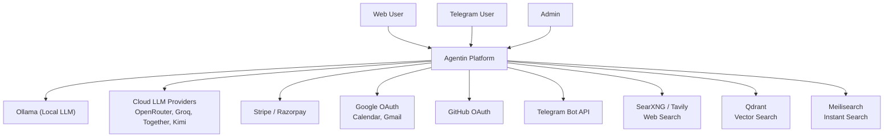

### Actors

| Actor | Description | Access |
|-------|-------------|--------|
| **Web User** | Browser-based access to dashboard, chat, portfolio | JWT authenticated |
| **Telegram User** | Chat via Telegram bot with voice, photos, keyboards | Telegram channel link |
| **Admin** | Ops dashboard, health monitoring | Admin token |
| **Webhook Caller** | Stripe, Razorpay, Telegram, n8n | Signed payloads |
| **Public Visitor** | Portfolio pages, public chat, docs | No auth required |

---

## Container View (C4 Level 2)

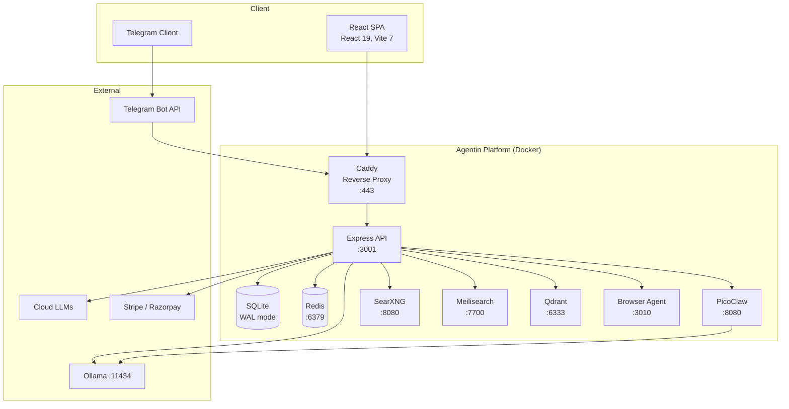

---

## Component View (C4 Level 3)

The Express backend follows a layered architecture:

```
Request → Middleware Stack → Route Handler → Service Layer → Repository / DB → Response
```

### Middleware Stack (applied in order)

| Order | Middleware | Source | Purpose |
|-------|-----------|--------|---------|
| 1 | `helmet()` | helmet | Security headers (CSP, HSTS, X-Frame-Options) |
| 2 | Permissions-Policy | custom | Restrict browser APIs (camera, mic, geo) |
| 3 | HSTS | custom | 1-year strict transport security (prod) |
| 4 | X-Robots-Tag | custom | Block API from search engines |
| 5 | CORS | cors | Whitelist origins, credentials allowed |
| 6 | `compression()` | compression | gzip/deflate (skips SSE streams) |
| 7 | Request ID | custom | `X-Request-Id` propagation for log correlation |
| 8 | Body parser | express.json | JSON parsing (1MB limit) |
| 9 | Content-Type guard | custom | Reject non-JSON mutations (CSRF prevention) |
| 10 | Passport | passport | OAuth2 strategy initialization |
| 11 | Request timeout | custom | 30-second default timeout |
| 12 | Request logger | pino | Structured request logging |
| 13 | Rate limiter | express-rate-limit | Global: 500/15min, Redis-backed |
| 14 | Metrics | custom | Request/response metrics collection |
| 15 | `errorHandler()` | custom | Catch-all error handler (last) |

### Route Layer

65+ route files in `server/src/routes/`, organized by domain. Each file defines Express router with:
- Path-specific rate limiting
- Zod schema validation (`validateBody`, `validateQuery`)
- Auth middleware (`requireAuth`, `optionalAuth`, `requireAdminToken`)
- Response formatting

### Service Layer

98 service files in `server/src/services/`, each handling one domain concern. Services:
- Contain business logic
- Access the database via `db.prepare()` (direct SQL) or repositories
- Call external APIs (LLM providers, Telegram, Stripe)
- Are imported by route handlers

### Repository Layer

5 repository classes in `server/src/repositories/`:

| Repository | Table(s) | Purpose |
|------------|----------|---------|
| `UserRepository` | users | User CRUD, preferences, plan management |
| `AgentConfigRepository` | agent_configs | Agent personality and model settings |
| `ConversationRepository` | conversations, messages | Chat history persistence |
| `SubscriptionRepository` | subscriptions | Billing subscription state |
| `ArtifactRepository` | artifacts, artifact_deployments | Generated artifact storage |

> Most services bypass repositories and use `db.prepare()` directly. See [`docs/MICROSERVICES_ROADMAP.md`](MICROSERVICES_ROADMAP.md) for the plan to expand repository coverage.

### Error Hierarchy

```
AgentinError (base)
├── NotFoundError (404)
├── UnauthorizedError (401)
├── ForbiddenError (403)
├── ValidationError (400)
└── PaymentRequiredError (402)
```

Defined in `server/src/errors/index.ts`. The `errorHandler` middleware catches these and returns structured JSON responses with request ID correlation.

---

## Request Lifecycle

### Web Chat Request

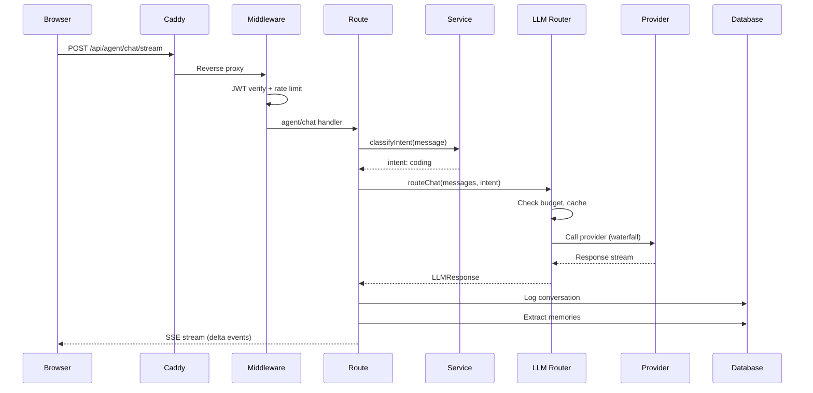

### Telegram Webhook Flow

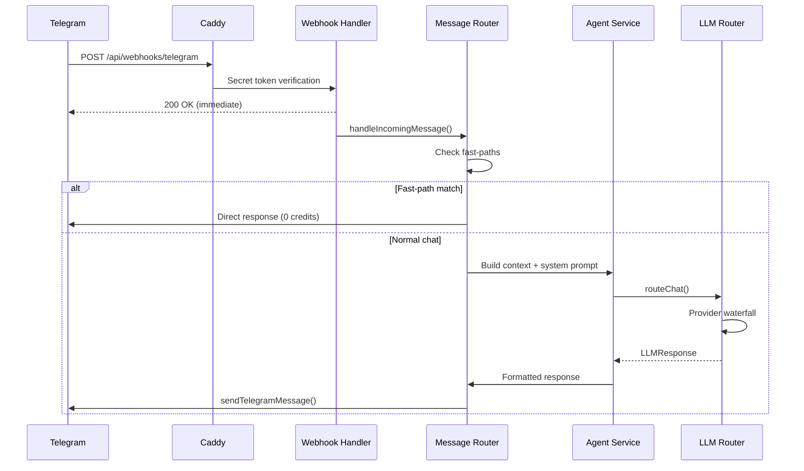

---

## LLM Routing Architecture

The LLM router (`server/src/services/llm.ts`) implements a multi-tier waterfall with intent-based routing.

### Intent Classification

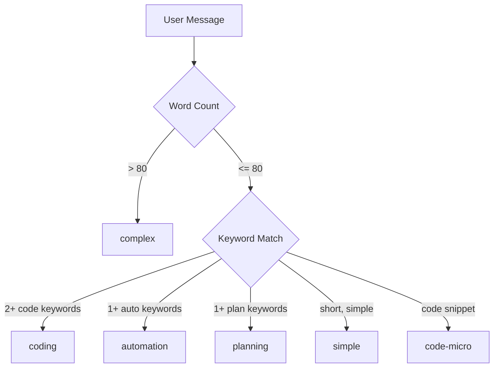

### Provider Waterfall

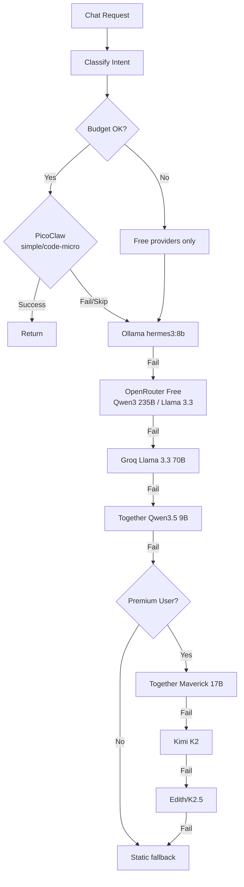

### Caching

| Layer | Storage | TTL | Max Entries | Key |
|-------|---------|-----|-------------|-----|
| L1 | In-memory Map | 5 min | 100 | MD5(messages + systemPrompt + userId) |
| L2 | Redis | 5 min | Unlimited | `llm:resp:{hash}` |

Cache is checked before provider calls. On hit, returns immediately with `provider: "cache"`.

### Budget Enforcement

| Check | Source | Effect |
|-------|--------|--------|
| Per-user monthly budget | `shouldDegradeRouting()` | Skip paid tiers, use free only |
| Together daily cap ($2.00) | `isOverDailyBudget()` | Skip Tier 3/4 for the day |
| Kimi per-user cap (3/day) | `kimiCalls` counter | Skip Tier 5 after 3 calls |
| Credit balance | `credit-service.ts` | Deduct credits post-response |

---

## Agent Architecture

### Personality System

9 agent personalities defined in `server/src/prompts/personalities.ts`:

| Agent | Domain | Fast-Path Triggers |
|-------|--------|--------------------|
| **Weebo** | General orchestrator | Default (delegates to others) |
| **Edith** | Expert knowledge | "edith", "@edith" |
| **Jarvis** | Task automation | "jarvis", "@jarvis" |
| **Aria** | Creative writing | "aria", "@aria" |
| **Forge** | Code generation | "forge", "@forge" |
| **Pulse** | Health/fitness | "pulse", "@pulse" |
| **Echo** | Memory recall | "echo", "@echo" |
| **Cal** | Calendar/scheduling | "cal", "@cal" |
| **Nova** | Research/analysis | "nova", "@nova" |

User messages containing agent names are routed directly via fast-path (`FASTPATH_AGENT_MAP` in `message-router.ts`).

### ReAct Loop

The ReAct loop (`server/src/services/react-loop.ts`) enables multi-step reasoning:

```
Think → Act → Observe → Think → Act → Observe → ... → Answer
```

The agent has 17 tools available for autonomous action execution, including web search, code execution, reminders, expenses, focus sessions, and more.

### Multi-Agent Council

When triggered ("launch mode"), the orchestrator (`multi-agent-orchestrator.ts`) fans out to 3 parallel specialists:
1. Each specialist processes the query independently
2. Results are collected and synthesized
3. A unified response is returned to the user

Cost: 6 credits (2 per specialist).

---

## Authentication & Authorization

### JWT Flow

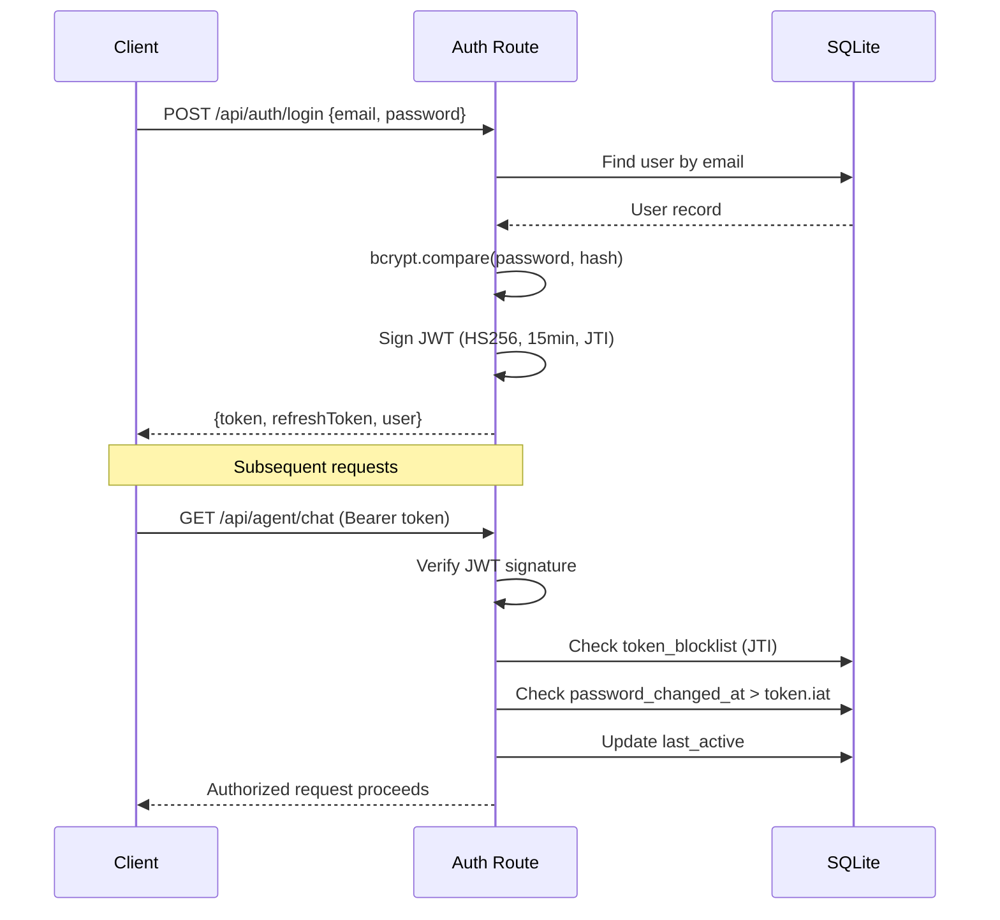

### Auth Methods

| Method | Provider | Usage |
|--------|----------|-------|
| JWT (HS256) | Internal | All API requests (15-min expiry) |
| Refresh Token | Internal | 30-day session renewal |
| OAuth 2.0 | Google, GitHub | Social login + Calendar/Gmail |
| Admin Token | Internal | Ops dashboard (`Authorization: Bearer <ADMIN_TOKEN>`) |
| Gate Cookie | Internal | Pre-login gate page (SHA-256 hash + `timingSafeEqual`) |
| Webhook Secret | Telegram | Bot webhook verification |
| Webhook Signature | Stripe/Razorpay | HMAC signature verification |

### Authorization Middleware

| Middleware | Effect |
|------------|--------|
| `requireAuth` | Validates JWT, checks blocklist, checks password change, updates last_active |
| `optionalAuth` | Same as requireAuth but proceeds as guest if no token |
| `requireAdminToken` | Validates admin Bearer token with timing-safe comparison |

---

## Data Architecture

### Database: SQLite with WAL

| Configuration | Value | Purpose |
|---------------|-------|---------|
| Journal mode | WAL | Concurrent reads + single writer |
| Cache size | 32MB | Page cache |
| Memory-mapped I/O | 256MB | Fast access |
| Busy timeout | 5s | Wait for locks before failing |
| Foreign keys | ON | Referential integrity |
| ANALYZE | On startup | Query plan optimization |

### Key Table Groups

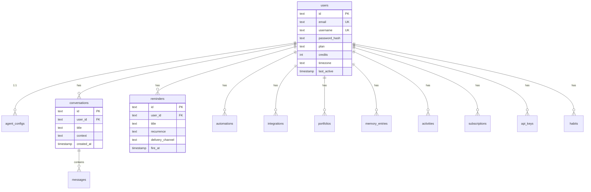

### Storage Services

| Service | Type | Purpose | Backend |
|---------|------|---------|---------|
| SQLite | Relational | Primary data store (users, conversations, reminders, etc.) | better-sqlite3 |
| Redis | Cache | Rate limits, LLM cache (L2), job queue, daily budgets | ioredis |
| Qdrant | Vector DB | Semantic memory search (768-dim embeddings) | REST API |
| Meilisearch | Search | Typo-tolerant instant search (notes, reminders, habits) | REST API |

---

## Event Architecture

### SSE Streaming

The platform uses Server-Sent Events for real-time communication:

| Stream | Endpoint | Events |
|--------|----------|--------|
| Chat | `/api/agent/chat/stream` | `delta` (text chunk), `done` (completion), `error`, `action` |
| Activity | `/api/activity/stream` | User actions, system events |
| Agent State | `/api/agent-state/stream` | Agent thinking, delegation, task progress |

### Internal Event Bus

`agent-state-bus.ts` provides in-memory pub/sub for agent collaboration events:

- `agent:thinking` -- Agent is processing
- `agent:delegated` -- Task delegated to specialist
- `agent:task_started` / `agent:task_completed` -- Background task lifecycle
- `agent:meeting` -- Multi-agent council session

> Current limitation: in-memory only (Map-based). Does not persist across PM2 workers. See [`docs/MICROSERVICES_ROADMAP.md`](MICROSERVICES_ROADMAP.md) for Redis pub/sub migration plan.

### Background Schedulers

| Scheduler | Interval | Purpose |
|-----------|----------|---------|
| Reminder Scheduler | 5s poll | Deliver due reminders via Telegram/email/push |
| Proactive Engine | 30min preview | Reminder previews, habit nudges at 11:00 IST |
| Morning Operator | Timezone-based | Daily briefing generation |
| Cleanup Service | Periodic | Delete old artifacts, logs, expired tokens |
| Job Queue | Event-driven | Async jobs (voice, image, video generation) |

---

## Integration Architecture

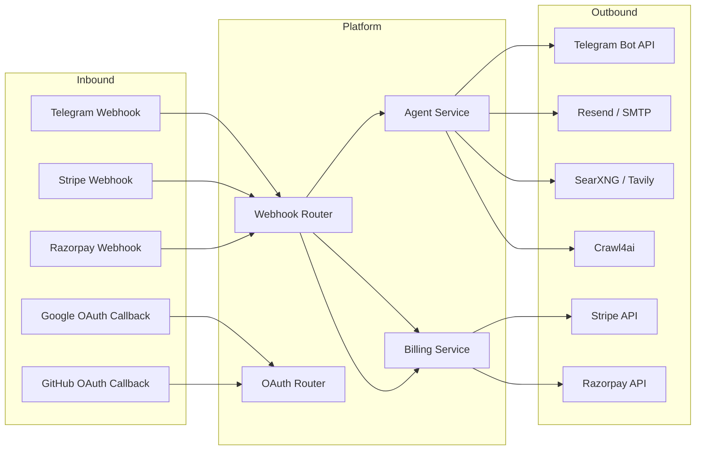

### Webhook Security

| Source | Verification Method |
|--------|-------------------|
| Telegram | `X-Telegram-Bot-API-Secret-Token` header comparison |
| Stripe | `stripe.webhooks.constructEvent()` with `STRIPE_WEBHOOK_SECRET` |
| Razorpay | HMAC-SHA256 signature verification with `timingSafeEqual` |

All webhook handlers return 200 immediately and process asynchronously.

---

## Security Architecture

### Defense in Depth

| Layer | Controls |
|-------|----------|
| **Network** | Caddy TLS termination, ports bound to 127.0.0.1, Docker network isolation |
| **Transport** | HSTS (1yr), TLS 1.3, auto-HTTPS via Let's Encrypt |
| **Application** | Helmet headers, CSP, CORS whitelist, Content-Type guard |
| **Authentication** | JWT HS256 (15min), bcrypt (cost 12), token blocklist, password-change invalidation |
| **Authorization** | Role-based (user/admin), per-endpoint rate limiting |
| **Data** | AES-256-GCM API key encryption (scrypt KDF), no plaintext secrets |
| **Infrastructure** | `no-new-privileges` on all containers, `cap_drop: ALL`, memory limits |
| **Validation** | Zod schemas on all mutating endpoints |
| **Monitoring** | Security audit logging, request ID correlation, Uptime Kuma alerts |

### Rate Limiting

| Scope | Limit | Window | Applies To |
|-------|-------|--------|-----------|
| Global | 500 req | 15 min | All endpoints |
| Auth | 10 req | 15 min | `/api/auth/*` |
| Signup | 5 req | 15 min | `/api/auth/signup` |
| Chat | 60 req | 15 min | `/api/agent/chat/*` |
| Public chat | 10 req | 15 min | `/api/agent/chat/public/*` |
| Billing | 5 req | 1 hour | `/api/billing/*` |
| Password change | 3 req | 1 hour | `/api/users/me/change-password` |
| Admin | 10 req | 1 min | `/api/admin/*` |

Rate limiting is Redis-backed (falls back to in-memory when Redis is unavailable).

---

## Credit & Billing Architecture

### Credit Economy

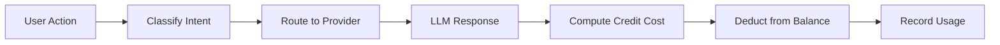

| Provider | Credit Cost |
|----------|-------------|
| Ollama | 1 credit flat |
| PicoClaw | 1 credit flat |
| OpenRouter Free | 2 credits flat |
| Groq | 2 credits flat |
| Together (budget) | 5 credits flat |
| Premium (Together/Edith) | 10 credits per 1K tokens (min 10) |
| Multi-Agent Council | 6 credits (2 per specialist) |
| Cache hit | 0 credits |

### Payment Gateways

| Gateway | Currency | Integration |
|---------|----------|-------------|
| Stripe | USD | Checkout sessions, subscription webhooks |
| Razorpay | INR | Order creation, signature verification |

### Subscription Tiers

| Tier | Credits/Month | LLM Access |
|------|--------------|------------|
| Free | 100 | Tiers 0-3 only |
| Pilot | 500 | Tiers 0-3 |
| Intro | 2,000 | Tiers 0-3 |
| Monthly | 10,000 | Tiers 0-6 (premium) |
| Half-Year | 50,000 | Tiers 0-6 (premium) |
| Yearly | 50,000 | Tiers 0-6 (premium) |

---

## Domain Boundary Map

The platform is organized into 13 bounded contexts. See [`docs/ddd/domains.md`](ddd/domains.md) for the formal bounded context definitions and cross-boundary rules.

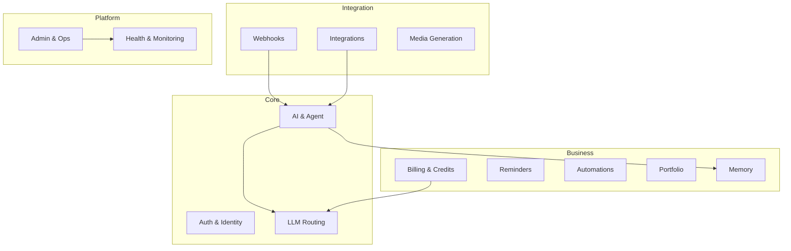

See [`docs/MICROSERVICES_ROADMAP.md`](MICROSERVICES_ROADMAP.md) for extraction plans per domain.

---

## Future State Architecture

### Near-Term (Modular Monolith)

- Enforce module boundaries via barrel exports (`server/src/modules/`)
- Expand repository coverage (move from direct `db.prepare()` to domain repositories)
- Migrate agent-state-bus to Redis pub/sub
- Add OpenAPI spec validation in CI

### Mid-Term (Service Extraction)

- Extract low-coupling domains first: health, media, portfolio, reminders
- Introduce event-driven communication via Redis Streams
- API versioning for extracted services

### Long-Term (Microservices)

- Independent deployment per domain
- PostgreSQL migration for multi-instance support
- Service mesh for observability
- Event sourcing for critical domains (billing, agent)

See [`docs/MICROSERVICES_ROADMAP.md`](MICROSERVICES_ROADMAP.md) for the detailed roadmap.

---

## Constraints & Known Limitations

| Constraint | Impact | Mitigation |
|------------|--------|-----------|
| SQLite single-writer | Cannot scale horizontally | WAL mode, Redis caching, future PostgreSQL migration |
| In-memory event bus | Events lost on restart, not shared across PM2 workers | Future Redis pub/sub migration |
| 32GB VPS | Resource-constrained for all services | Container memory limits, OOM protection, Ollama model size limits |
| `message-router.ts` (2050 LOC) | High coupling, difficult to test | Target for domain extraction (see Microservices Roadmap) |

---

## Related Documents

- [`README.md`](../README.md) -- Project overview and quick start
- [`docs/ARCHITECTURE.md`](ARCHITECTURE.md) -- Legacy architecture doc (LLM routing focus)
- [`docs/DEVELOPER_GUIDE.md`](DEVELOPER_GUIDE.md) -- Development setup and conventions
- [`docs/API_REFERENCE.md`](API_REFERENCE.md) -- API endpoint documentation
- [`docs/DEVOPS.md`](DEVOPS.md) -- Infrastructure and operations
- [`docs/MICROSERVICES_ROADMAP.md`](MICROSERVICES_ROADMAP.md) -- Domain extraction strategy
- [`docs/ddd/domains.md`](ddd/domains.md) -- Bounded context definitions
- [`docs/adr/ADR-001-llm-waterfall-phase111.md`](adr/ADR-001-llm-waterfall-phase111.md) -- LLM waterfall decision
- [`docs/BUSINESS_FEATURES.md`](BUSINESS_FEATURES.md) -- Feature inventory and credit economy
