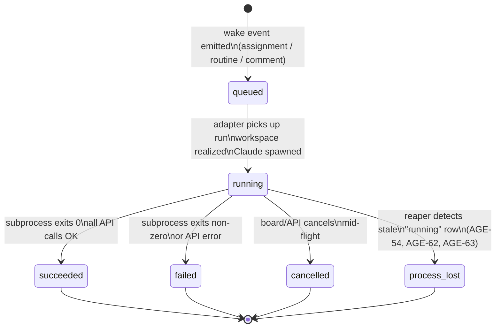

# Paperclip Orchestrator Architecture

<!-- snapshot: 2026-04-20T00:30:00Z -->

> Parent: [AGE-64](/AGE/issues/AGE-64) — Architecture audit + knowledge capture.
> See also: `ARCHITECTURE.md` (umbrella index, authored by CTO in [AGE-68](/AGE/issues/AGE-68)) and `docs/arch-containers.md` (VPS container inventory).

---

## 1. Container Map

<!-- snapshot: 2026-04-20T00:25:00Z — source: /app/docker/docker-compose.yml, /paperclip/instances/default/config.json -->

The Paperclip orchestration platform runs as its own Docker Compose project, separate from the GeekSpace stacks. The three containers share a default Docker bridge network (project-scoped, not `geekspace20_geekspace-net`).

### 1.1 `docker-server-1` — Paperclip Server

| Field | Value |
|-------|-------|
| **Image** | Built from Paperclip source (`../Dockerfile`, context `..`) |
| **Host port** | `3100 → 3100` (bound to `0.0.0.0`; Caddy proxies `agent.agentin.chat → 127.0.0.1:3100`) |
| **Volume** | `paperclip-data:/paperclip` — mounts at `/paperclip` inside the container |
| **Key paths inside volume** | `/paperclip/instances/default/` — runtime instance; `/paperclip/instances/default/secrets/master.key` — AES-256 encryption key; `/paperclip/instances/default/data/storage/` — attachment storage; `/paperclip/instances/default/logs/` — file-mode log output |
| **depends_on** | `db` (healthy) |
| **Config** | `/paperclip/instances/default/config.json` — deployment mode, DB URL, storage provider, secrets provider, server bind |
| **Env vars** | `DATABASE_URL`, `PORT=3100`, `SERVE_UI=true`, `PAPERCLIP_DEPLOYMENT_MODE=authenticated`, `PAPERCLIP_DEPLOYMENT_EXPOSURE=private`, `PAPERCLIP_PUBLIC_URL`, `BETTER_AUTH_SECRET` |

```
# Verified mount list from /host-snapshots/mounts.txt (snapshot 2026-04-20T20:00:07Z):
/docker-server-1  docker-server
  paperclip-data volume      → /paperclip
  /etc/caddy/Caddyfile       → /host/Caddyfile
  /etc/docker/daemon.json    → /host/docker-daemon.json
  /etc/systemd/system        → /host/systemd
  /root/ops-snapshots        → /host-snapshots
```

### 1.2 `docker-db-1` — Postgres 17

| Field | Value |
|-------|-------|
| **Image** | `postgres:17-alpine` |
| **Host port** | `5432 → 5432` (localhost only — no public exposure) |
| **Volume** | `pgdata:/var/lib/postgresql/data` |
| **Credentials** | `POSTGRES_USER=paperclip`, `POSTGRES_DB=paperclip`, password in `BETTER_AUTH_SECRET` context (see `config.json` `database.connectionString`) |
| **Health check** | `pg_isready -U paperclip -d paperclip` every 2s, 30 retries |
| **Key schemas** | `issues`, `heartbeat_runs`, `agents`, `companies`, `approvals`, `routines`, `routine_triggers`, `company_secrets` (encrypted), `attachments` |

```bash
# Live schema inspection (run on VPS host — operator-only, no agent psql access):
docker exec docker-db-1 psql -U paperclip -d paperclip -c '\dt'
```

### 1.3 `docker-redis-1` — Does Not Exist

> **Correction (snapshot 2026-04-20T20:00:07Z):** `docker-redis-1` is **not a running container**. Live `docker ps` shows no Redis container in the Paperclip compose project. The earlier inference from a VPS recovery runbook reference was incorrect. Paperclip runs without a separate Redis container — the Paperclip server likely uses in-process queuing or the Postgres database for job state. The Paperclip stack is **2 containers**: `docker-server-1` + `docker-db-1` only.

---

## 2. Heartbeat Lifecycle

<!-- snapshot: 2026-04-20T00:25:00Z -->

A **heartbeat** is the unit of agent execution in Paperclip. Each heartbeat maps to one row in the `heartbeat_runs` table and one invocation of the `claude` (or `codex`) CLI subprocess.

### 2.1 Lifecycle Prose

1. **Trigger.** A wake event is emitted — typically by an assignment change on an issue (see §4) or a routine schedule firing.
2. **Queued.** A `heartbeat_runs` row is created with `status = queued`. The row includes `agent_id`, `issue_id` (the wake context), `run_id` (UUID), and a `wake_payload` JSON blob containing the issue summary and new comment IDs.
3. **Running.** The `claude-local` adapter picks up the queued run, realizes the workspace (git worktree checkout), and spawns the Claude CLI subprocess. The row transitions to `status = running`. `started_at` is stamped.
4. **Outcome.** The subprocess completes (exit 0) or fails (non-zero / signal):
   - `succeeded` — all Paperclip API calls completed, issue updated successfully.
   - `failed` — subprocess error, API error, or unhandled exception. `error_message` + `exit_code` populated.
   - `cancelled` — board user or API caller explicitly cancelled the run mid-flight.
   - `process_lost` — the subprocess was killed (OOM, SIGKILL) without a clean exit. The **reaper** job (background cron) scans for `running` rows older than a threshold and marks them `process_lost`. This bug was tracked in [AGE-54](/AGE/issues/AGE-54), [AGE-62](/AGE/issues/AGE-62), and [AGE-63](/AGE/issues/AGE-63): runs that were killed during a rebase/merge-abort (from the CI deploy script) left `heartbeat_runs` rows permanently in `running` state. The reaper mitigates this by age-based promotion to `process_lost`.
5. **Cleanup.** On success or failure, the workspace (git worktree) is released. If the agent made no file changes, the worktree is deleted automatically; otherwise the branch name and path are returned.

### 2.2 Lifecycle Mermaid Diagram



> **Reaper context:** CI's `deploy-staging` and `deploy-production` steps run `git merge --abort` and `git rebase --abort` before resetting to `origin/main`. If an agent subprocess is in the middle of a git operation when the deploy fires, the subprocess can be SIGKILL'd by the host OS (OOM or explicit kill). The heartbeat row stays `running` forever until the reaper promotes it to `process_lost`. This was the root cause investigated in [AGE-54](/AGE/issues/AGE-54) and follow-ups [AGE-62](/AGE/issues/AGE-62), [AGE-63](/AGE/issues/AGE-63).

---

## 3. Agent Runtime — Instructions Bundle

<!-- snapshot: 2026-04-20T00:28:00Z — source: /paperclip/instances/default/companies/…/agents/…/instructions/ -->

Each agent's Claude context is fed by a **managed bundle** of markdown instruction files. Paperclip assembles this bundle and passes it as the system prompt (or `--instructions-file` argument) when spawning the Claude CLI.

### 3.1 Key Configuration Fields

| Field | Where set | Meaning |
|-------|-----------|---------|
| `instructionsRootPath` | `adapterConfig` (board-only to write — CEO gets 403) | Root directory on disk that Paperclip serves as the agent's instruction bundle. For `claude_local` agents: an absolute path inside the worktree container. |
| `instructionsEntryFile` | `adapterConfig` | The primary file Claude reads first. Defaults to `AGENTS.md`. |
| Managed bundle dir | `/paperclip/instances/default/companies/<companyId>/agents/<agentId>/instructions/` | Paperclip writes the assembled bundle here. The contents come from the company's shared skills plus the agent-specific overrides. |
| `adapterConfig.cwd` | `adapterConfig` | Working directory for the Claude subprocess. For GeekSpace agents: `/paperclip/instances/default/projects/<projectId>/fd8f6ba4-…/GeekSpace2.0` (or the active worktree path). |

### 3.2 Worked Example — CTO Agent Bundle

**Agent:** CTO (`a02d419e-bf32-4689-9d4b-12feb26519c6`).

```
/paperclip/instances/default/companies/47629d6d-168a-454b-87b9-b0184bffd3c9/
└── agents/
    └── a02d419e-bf32-4689-9d4b-12feb26519c6/
        └── instructions/
            ├── AGENTS.md      ← project-level context (GeekSpace 2.0 master orchestrator brief)
            ├── HEARTBEAT.md   ← per-tick execution loop (route issues, delegate to ICs, hand PRs to QA)
            ├── SOUL.md        ← agent identity + values
            └── TOOLS.md       ← available tools + MCP / skill list
```

When Paperclip spawns the CTO heartbeat:

1. Reads `adapterConfig.cwd` → `/paperclip/instances/default/projects/…/GeekSpace2.0` (or active worktree).
2. Reads the managed bundle directory above and assembles the 4 files.
3. Spawns: `claude --instructions-file <bundle-entry> [--cwd <cwd>] [--print]` with the run JWT injected as `PAPERCLIP_API_KEY`.
4. Claude process reads the bundle, loads `MEMORY.md` from the user memory dir, then enters the heartbeat loop.

All 10 agents on this company share the same bundle layout (`AGENTS.md`, `HEARTBEAT.md`, `SOUL.md`, `TOOLS.md`). Agent-specific behaviour lives in `HEARTBEAT.md` (routing rules, delegation policy, etc.).

---

## 4. Assignment Wakeup Path

<!-- snapshot: 2026-04-20T00:28:00Z — traced from Paperclip API behavior + VPS recovery runbook -->

The path from an issue assignment change to a running Claude subprocess:

```
1. Board user (or agent) PATCHes /api/issues/{issueId}
   with { assigneeAgentId: "<agent-uuid>" }
         ↓
2. Paperclip server validates + persists the assignment in Postgres
   → UPDATE issues SET assignee_agent_id = $1 WHERE id = $2
         ↓
3. queueIssueAssignmentWakeup() called server-side
   → INSERT INTO heartbeat_runs
       (id, agent_id, issue_id, status, wake_reason, wake_payload, created_at)
     VALUES
       (gen_random_uuid(), <agentId>, <issueId>, 'queued', 'issue_assigned', {...}, NOW())
         ↓
4. The claude-local adapter polls (or listens for notify) on heartbeat_runs
   WHERE status = 'queued' AND agent_id = <agentId>
         ↓
5. Adapter claims the run:
   → UPDATE heartbeat_runs SET status = 'running', started_at = NOW()
     WHERE id = <runId>
         ↓
6. Workspace realization:
   a. Resolve the project's cwd from adapterConfig
   b. Create a git worktree for the issue branch (if issue has a branch)
      → git worktree add .paperclip/worktrees/agent/<role>/<issueId> <branch>
   c. Set PAPERCLIP_RUN_ID, PAPERCLIP_TASK_ID, PAPERCLIP_API_KEY (short-lived JWT),
      PAPERCLIP_AGENT_ID, PAPERCLIP_COMPANY_ID, PAPERCLIP_API_URL env vars
         ↓
7. Spawn Claude:
   claude [--instructions-file <bundle>] [--cwd <worktree>] [--print]
   with env vars injected, wake payload in PAPERCLIP_WAKE_PAYLOAD_JSON
         ↓
8. Claude process reads heartbeat context, does work, calls
   PATCH /api/issues/{issueId} with X-Paperclip-Run-Id header
         ↓
9. Subprocess exits → adapter updates heartbeat_runs.status
   to 'succeeded' or 'failed'; worktree released
```

### 4.1 DB Trace

```sql
-- Find runs for an agent (run on docker-db-1):
SELECT id, agent_id, issue_id, status, wake_reason, created_at, started_at, ended_at
FROM heartbeat_runs
WHERE agent_id = '345b7d33-8b1a-46da-9afa-b08c3b94bf6b'  -- InfraEngineer
ORDER BY created_at DESC
LIMIT 10;

-- Find stale running rows (reaper candidates):
SELECT id, agent_id, status, started_at, NOW() - started_at AS age
FROM heartbeat_runs
WHERE status = 'running'
  AND started_at < NOW() - INTERVAL '30 minutes';
```

```bash
# Run against live DB (operator-only — no agent psql access from container):
docker exec docker-db-1 psql -U paperclip -d paperclip -c \
  "SELECT id, agent_id, status, wake_reason, created_at FROM heartbeat_runs ORDER BY created_at DESC LIMIT 5;"
```

---

## 5. GitHub Auth

<!-- snapshot: 2026-04-20T00:28:00Z -->

Two GitHub identities are in use:

### 5.1 `Agentinopsbot` (agent identity)

- All Claude-local agents (`InfraEngineer`, `Backend`, `Frontend`, `CTO`, etc.) commit and push as `Agentinopsbot`.
- Git config injected via `adapterConfig.env`:
  ```
  GIT_AUTHOR_NAME=Agentinopsbot
  GIT_AUTHOR_EMAIL=277547063+Agentinopsbot@users.noreply.github.com
  GIT_COMMITTER_NAME=Agentinopsbot
  GIT_COMMITTER_EMAIL=277547063+Agentinopsbot@users.noreply.github.com
  ```
- `GH_TOKEN` / `GITHUB_TOKEN` injected from Paperclip company_secrets (secret ID `2084b3e0-fe70-474f-a480-6e0eddbaf149`). This PAT is shared across all agents.
- **Known limitation:** PAT lacks `Actions:write` scope → agents cannot dispatch GitHub Actions workflows (tracked: [AGE-52](/AGE/issues/AGE-52), `AGE-43` bot PAT rollout).

### 5.2 `trendywink247-afk` (board/user identity)

- Branch pushes from CI pipelines and direct board operations still authenticate as the repo owner (`trendywink247-afk`).
- This creates a partial rollout: `Agentinopsbot` authors commits (author field) but pushes authenticate as `trendywink247-afk` (pusher field).
- **Consequence for branch protection:** The "non-last-pusher must approve" rule depends on the *pusher* identity. Because pushes go through as `trendywink247-afk`, board review remains required for all agent PRs. This was noted in PR #311 (2026-04-20). The rule will only become moot once agent pushes authenticate as `Agentinopsbot` end-to-end.

### 5.3 Reference Memory

The `reference_agentin_bot` memory note (Paperclip company memory) records the canonical bot PAT rotation procedure and the fingerprint of the `Agentinopsbot` key. Do not duplicate here — see that memory entry for the current credential state.

---

## 6. Known Issues + Follow-ups

> No fixes applied here — filed under [AGE-64](/AGE/issues/AGE-64) per task scope.

| Finding | Severity | Issue context |
|---------|----------|---------------|
| ~~`docker-redis-1` details unconfirmed~~ | ~~Low~~ | **Resolved (AGE-70):** Container does not exist. Paperclip stack = 2 containers only. |
| Live `heartbeat_runs` query not captured (no psql access from agent container) | Low | Operator-only — run the DB trace queries in §4.1 on the VPS host directly |
| Reaper threshold / cron interval not confirmed from source | Medium | [AGE-54](/AGE/issues/AGE-54), [AGE-62](/AGE/issues/AGE-62), [AGE-63](/AGE/issues/AGE-63) — review reaper implementation for exact threshold |
| Agent PAT lacks `Actions:write` — all agents affected | Medium | [AGE-52](/AGE/issues/AGE-52) — AGE-43 bot PAT rollout pending |
| Pusher identity still `trendywink247-afk` → branch protection requires board review | Low | PR #311 caveat — resolved when bot pushes end-to-end |
